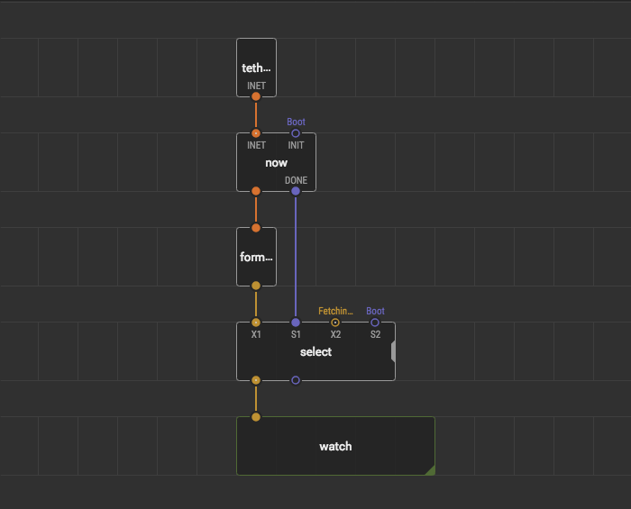

<!--
This file is auto-generated from the 'welcome-to-xod' project.
Do not change this file manually because your changes may be lost after
the tutorial update.

To make changes, change the 'welcome-to-xod' contents or 'before-1st-h2.md'.

If you want to change a Fritzing scheme or comments for it, change the
'before-1st-h2.md' in the documentation directory for the patch.

Then run auto-generator tool (xod/tools/generate-tutorial-docs.js).
-->

Note
This is a web-version of a tutorial chapter embedded right into the XOD IDE.
To get a better learning experience we recommend to install the
<a href="/downloads/">desktop IDE</a> or start the
<a href="/ide/">browser-based IDE</a>, and you’ll see the same tutorial there.

# Internet Tethering

There is a large class of applications known as IoT (Internet of Things) when the hardware connects to the Internet to send or receive data from some server. For example, log the temperature and moisture for smart greenhouses, get the current time, weather, send third-party service API request, and so on.

In this chapter, we are going to fetch the current date/time from the XOD Cloud API.

The `xod-cloud/basics/now` node sends a request to the XOD Cloud, parses the response, and outputs it as a `datetime` type value.

This node has an input pin `INET`. This pin has to be connected to an internet provider. The Internet can be provided:

- by the controller board (such as ESP8266)
- by an extension module (such as W5500 Ethernet Shield)
- **by your PC**. This trick is known as Internet tethering and works in simulation and debug modes

Note, we’ve placed a `select` node here to get a reasonable value until we receive the result from the cloud. Otherwise, we would get a default datetime value, which is equal to `1970-01-01 00:00:00`, and it might be confusing.

## Excercise

Update the current datetime value by sending pulses.

1.  Place a `tweak-pulse` node.
2.  Link it to the `INIT` pin
3.  To make a value in the `watch` node properly, you need to provide the third possible value `"Waiting pulse"`. Drag the handle of the `select` node to the right to add one more pair of input pins
4.  Bind `"Waiting pulse"` and "On Boot" to the latest pair of pins.
5.  Link `tweak-pulse` to the `S2` pin
6.  Simulate the patch and send pulse using the `tweak-pulse` node.

  

    <a href="../013-custom-types/">← Previous lesson</a>
  

  

    <a href="../">Index</a>
  

  

    <a href="../015-xod-cloud-feeds/">Next lesson →</a>
  

