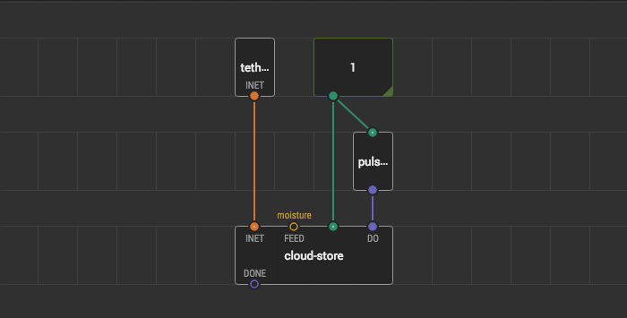

<!--
This file is auto-generated from the 'welcome-to-xod' project.
Do not change this file manually because your changes may be lost after
the tutorial update.

To make changes, change the 'welcome-to-xod' contents or 'before-1st-h2.md'.

If you want to change a Fritzing scheme or comments for it, change the
'before-1st-h2.md' in the documentation directory for the patch.

Then run auto-generator tool (xod/tools/generate-tutorial-docs.js).
-->

Note
This is a web-version of a tutorial chapter embedded right into the XOD IDE.
To get a better learning experience we recommend to install the
<a href="/downloads/">desktop IDE</a> or start the
<a href="/ide/">browser-based IDE</a>, and you’ll see the same tutorial there.

# XOD Cloud Feeds

The basic Internet-of-Things applications is mostly about collecting some data and storing it in the cloud, or reacting to the data changes.

It can improve a production process on factories, lower the defect rate, and so on. Also, it integrates into a life of ordinary people: smart fridges, homes, greenhouses, wearable electronics, etc.

Some systems have their servers to collect the data. Still, for the individuals, maintaining such infrastructure is too complicated and expensive. Here comes the [XOD Cloud](https://xod.io/docs/guide/getting-started-with-feeds/?utm_source=ide&utm_medium=ide_comment&utm_campaign=tutorial) service. Using it you can store and retrieve any data.

XOD provides the standard library called `xod-cloud/feeds` to work with cloud feeds easily. It has nodes to store and retrieve data.

You can see all your stored data at [https://xod.io/feeds/](https://xod.io/feeds/?utm_source=ide&utm_medium=ide_comment&utm_campaign=tutorial)

Now we’re going to store data in the cloud. In one of the next sections of the tutorial, we’ll retrieve the data and react to it.

You can see a `cloud-store` node here. This node stores data to your private feed. The feed is log-like storage of your data. The name of the feed is a path, like a path in URL or your filesystem. For example, `bob/smart-home-project/room1/temperature`. The `cloud-store` node prepends the username and project name automatically to the path. That's why we bound the `"moisture"` value to the `FEED` input instead of a full path.

The program is ready, but to make it work, you have to do a few things related to authorization.

## Excercise

1. Log in into your XOD account in the Account Pane (hit View → Toggle Account Pane).
2. Open Project Preferences (hit Edit → Project Preferences). Ensure that the project has a name and click the "Generate" button next to the "XOD Cloud API Key" input.
3. Run a simulation and change the value of a `tweak-number` node several times.
4. Open the [feeds](https://xod.io/feeds/?utm_source=ide&utm_medium=ide_comment&utm_campaign=tutorial) page and check out the data stored in the feed named `YOUR_USERNAME/welcome-to-xod/moisture`.

  

    <a href="../014-internet-tethering/">← Previous lesson</a>
  

  

    <a href="../">Index</a>
  

  

    <a href="../100-hardware/">Next lesson →</a>
  

