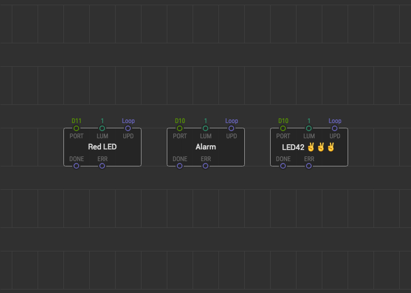

#07. Наименование нод

Примечание
Это веб-версия обучения, встроенная прямо в XOD IDE.
Для удобства обучения, мы рекомендуем установить
<a href="/downloads/">desktop IDE</a> или открыть
<a href="/ide/">browser-based IDE</a>, и вы увидите тот же учебник.

Очень часто, вам необходимл использовать несколько идентичных 
аппаратных компонентов для управления различными аспектами 
устройства или реализовать несколько каналов чего-то.
Чтобы избежать путаницы, вы можете переименовать ноды.

Функции и тип каждого нода остаются неизменными. 
Переименование вашей ноды только делает ваш патч более читабельным. 
Вы всегда можете проверить тип исходного нода в Инспекторе.

## Как использовать

1. Выберите ноду, которую вы хотите переименовать.
2. В Инспекторе есть поле с зеленым флагом; вы может найти его 
выше контактов. Введите любое имя ноды в это поле.

