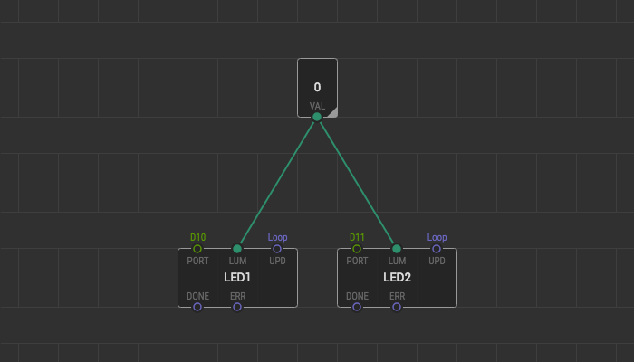

# #08. Постоянные ноды

Примечание
Это веб-версия обучения, встроенная прямо в XOD IDE.
Для удобства обучения, мы рекомендуем установить
<a href="/downloads/">desktop IDE</a> или открыть
<a href="/ide/">browser-based IDE</a>, и вы увидите тот же учебник.

Вы можете указать значения пинов вручную с помощью Инспектора. 
Однако, данные могут передаваться с выходного вывода одного нода на 
входной вывод другого нода. Это основная идея программирования XOD.

Простейшим источником выходных значений является постоянный нода. 
Его выходное значение никогда не изменяется во время выполнения программы. 
Хотя, программируя, вы можете установить его значение как обычно, 
с помощью Инспектора.

## Схема

Примечание
Схема, как и в прошлом уроке.

[↓ Скачать Fritzing проект](./circuit.fzz)

## Как использовать

1. Найдите ноду `constant-number` под `xod/core` и добавьте его в патч.
2. Подключите выходной пин `VAL` к входу другой ноды. Сделать это,
    просто щелкните по значку `VAL`, а затем на пине адресата. Вы тогда
    увидите зеленую линию, соединяющую два пина. 
	Эта линия называется *link*.
3. Задайте требуемое постоянное значение через Инспектор.

