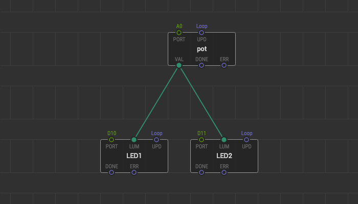

# #09. Подключение Потенциометра

Примечание
Это веб-версия обучения, встроенная прямо в XOD IDE.
Для удобства обучения, мы рекомендуем установить
<a href="/downloads/">desktop IDE</a> или открыть
<a href="/ide/">browser-based IDE</a>, и вы увидите тот же учебник.

Часто источником переменных значений является потенциометр (или просто и 
коротко “pot”). Он позволет очень удобно, просто и плавно настроить некоторые 
параметры.

Существует специальная нода `pot` для считывания значений с потенциометра. 
Вы найдёте её в библиотеке `xod/common-hardware`.

## Схема

[↓ Скачать Fritzing проект](./circuit.fzz)

## Как использовать

1. Добавьте ноду `pot` в свой патч.
2. Установите значение `PORT` на ноде `pot` на A0, если вы подключили
    потенциометр к пину Arduino A0, как показано выше.
3. Соедините пин `VAL` ноды `pot`, с входным пинами управляемых нод.

В нашем примере, если вы повернете ручку потенциометра,то это повлияет на
яркость светодиодов. 
В зависимости от угла поворота ручки, нода `pot` меняет значение 
от 0.0 до 1.0 на пине `VAL`, и это значение передается к пинам `LUM` 
обоих нодов светодиодов. 
