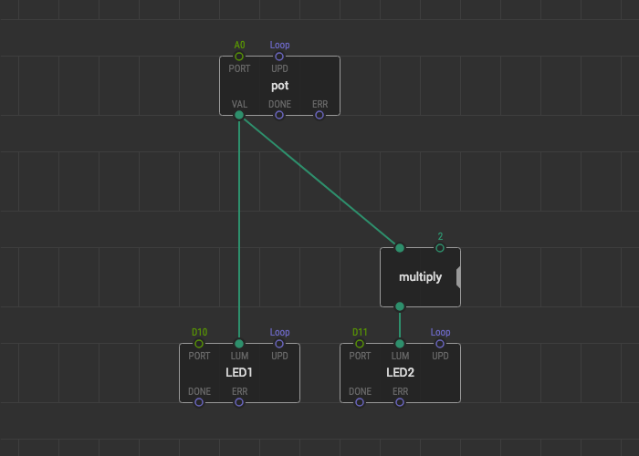

# #10. Математические операции

Примечание
Это веб-версия обучения, встроенная прямо в XOD IDE.
Для удобства обучения, мы рекомендуем установить
<a href="/downloads/">desktop IDE</a> или открыть
<a href="/ide/">browser-based IDE</a>, и вы увидите тот же учебник.

Вы, наверное, заметили, что пины имеют разные цвета.

Цвет пина указывает на _тип_ данных.
Зеленые пины могут принимать и возвращать числовые значения. 
Синие пины работают со, специальными типами данных, к которому мы вернемся позже.

Давайте попробуем посчитать.

Как вы можете догадаться, нода `multiply` передает результат умножения
чисел из входных пинов (`IN1` и `IN2`) на выходные пины.

В `xod/core` вы найдёте ноды  для различных математических и тригонометрических
расчетов. Рядом с нодой `multiply` вы найдёте `add` (добавить), `subtract` (вычесть),
и `divide` (разделить) для наиболее простых и частых вычислений.

## Схема

Примечание
Схема, как и в прошлом уроке.

[↓Скачать Fritzing проект](./circuit.fzz)

## Как использовать

1.  Добавьте новый `multiply` или другую математическую ноду.
2.  Кликните на пин слева вверху для указания входного значения (в Инспекторе или соедините с выходом другой ноды).
3.  Кликните на пин слева внизу и соедините с входным пином другой ноды.

Поверните ручку потенциометра. Если вы следовали примеру, то на LED2 светодиоде 
будет максимальная яркость на половине оборота потенциометра (на светодиоде LED1 ярость будет в два раза меньше). 
Это происходит поскольку нода `multiply` умножила входные значения на 2 и передала их на пин `OUT`, 
который соединен с пином `LUM` светодиода LED2. 
