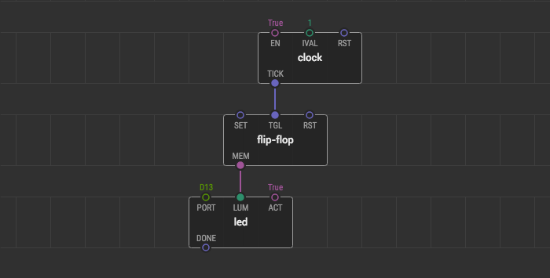

<!--
This file is auto-generated from the 'welcome-to-xod' project.
Do not change this file manually because your changes may be lost after
the tutorial update.

To make changes, change the 'welcome-to-xod' contents or 'before-1st-h2.md'.

If you want to change a Fritzing scheme or comments for it, change the
'before-1st-h2.md' in the documentation directory for the patch.

Then run auto-generator tool (xod/tools/generate-tutorial-docs.js).
-->

Note
This is a web-version of a tutorial chapter embedded right into the XOD IDE.
To get a better learning experience we recommend to install the
<a href="/downloads/">desktop IDE</a> or start the
<a href="/ide/">browser-based IDE</a>, and you’ll see the same tutorial there.

# Uploading Programs

To make a program work XOD converts it to C++ code, then compiles it to a binary firmware compatible with the board of choice, then pushes the binary to the board itself.

The process is automated and runs behind the scenes once you hit “Upload”. However, many tools are involved and the initial XOD IDE installation can lack some of them. When you upload to a new kind of a board for the first time, a message will appear asking to Download & Install required tools. Confirm to setup them automatically. Keep in mind, it can consume 200 MB or so of Internet traffic and take up a few minutes.

## Exercise

Let's upload this patch to the Arduino board to see the built-in LED blinking.

1. Connect the Arduino board to your computer with a USB cable.
2. Upload the program. To do this, hit Deploy → Upload to Arduino from the main menu.
3. If some tools are missing, confirm the installation by clicking Download & Install in the message appeared.

See the on-board LED usually marked with the `L` letter blinking.

Change the `IVAL` value on the `clock` node and upload the program again. See how the blinking frequency of the LED changes.

## 👆 Shortcut

You can click the button with a lightning icon in the deployment pane at the bottom of the screen instead of using the main menu.

  

    <a href="../100-hardware/">← Previous lesson</a>
  

  

    <a href="../">Index</a>
  

  

    <a href="../102-interactive/">Next lesson →</a>
  

