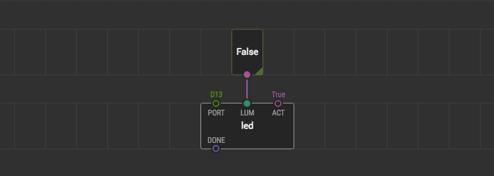

<!--
This file is auto-generated from the 'welcome-to-xod' project.
Do not change this file manually because your changes may be lost after
the tutorial update.

To make changes, change the 'welcome-to-xod' contents or 'before-1st-h2.md'.

If you want to change a Fritzing scheme or comments for it, change the
'before-1st-h2.md' in the documentation directory for the patch.

Then run auto-generator tool (xod/tools/generate-tutorial-docs.js).
-->

Note
This is a web-version of a tutorial chapter embedded right into the XOD IDE.
To get a better learning experience we recommend to install the
<a href="/downloads/">desktop IDE</a> or start the
<a href="/ide/">browser-based IDE</a>, and you’ll see the same tutorial there.

# Interactive Session

As you run the simulation, you can run an *interactive session* on the board also known as debugger. Tweaks and watches go live while running the program on physical hardware.

## Exercise

Let’s control our LED in real time.

1. Connect the Arduino board to your computer.

2. Upload the program with the interactive session enabled: hit Deploy → Upload to Arduino and check "Debug after upload".

3. Once the interactive session has been started, select `tweak-boolean` and change its value; see how the built-in LED on the board reacts to these changes.

To stop the interactive session press "Stop" button on the green panel above. To start the interactive session again, you have to re-upload the program.

## 👆 Shortcut

Click the button with a bug icon in the deployment pane below. To quickly access the upload dialog with “Debug after upload” checked.

## Debug protocol

During interactive sessions XOD IDE and the board keep connection open and exchange with messages about value changes. These message are simple plain-text lines and you can see them in the Serial tab of the Deployment pane.

Click the funnel icon and make sure “Watched Values” is checked. To echo the messages to the log.

  

    <a href="../101-upload/">← Previous lesson</a>
  

  

    <a href="../">Index</a>
  

  

    <a href="../103-led/">Next lesson →</a>
  

