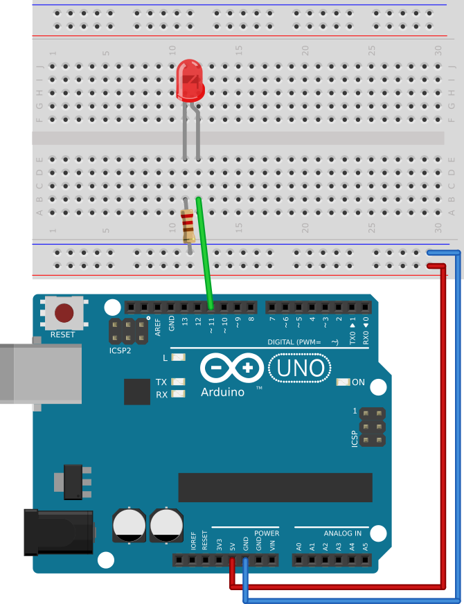

<!--
This file is auto-generated from the 'welcome-to-xod' project.
Do not change this file manually because your changes may be lost after
the tutorial update.

To make changes, change the 'welcome-to-xod' contents or 'before-1st-h2.md'.

If you want to change a Fritzing scheme or comments for it, change the
'before-1st-h2.md' in the documentation directory for the patch.

Then run auto-generator tool (xod/tools/generate-tutorial-docs.js).
-->

Note
This is a web-version of a tutorial chapter embedded right into the XOD IDE.
To get a better learning experience we recommend to install the
<a href="/downloads/">desktop IDE</a> or start the
<a href="/ide/">browser-based IDE</a>, and you’ll see the same tutorial there.

# LED Node

You already made a blinking LED and controlled it in the interactive session. But you have only feed it with the values of true and false. The false value auto-converts to 0 and represents no glow at all, whereas the true value converts to 1 and denotes the full brightness.

You can also set an intermediate brightness level by setting values _between_ 0 and 1.

## Circuit

[↓ Download as a Fritzing project](./circuit.fzz)

## Exercise

Let’s fine-tune LED brightness.

1. Assemble a circuit according to the [scheme](https://xod.io/docs/tutorial/103-led/?utm_source=ide&utm_medium=ide_comment&utm_campaign=tutorial#circuit), and connect the board to your computer.

2. Set the value of the `PORT` pin to `D11`. Leading "D" means that it's a digital port.

3. Replace the `tweak-boolean` node with `tweak-number`.

4. Upload the program with the interactive session enabled.

5. Change the value of `tweak-number` in the range from 0 to 1 and see how the brightness of the LED changes.

## 👆 PWM feature

An LED can change the brightness only if connected to a board pin which supports PWM. If you have an Arduino board, find out the port number with the leading "~" symbol.

Many board models have no PWM on D13, so we wire the LED to another pin.

  

    <a href="../102-interactive/">← Previous lesson</a>
  

  

    <a href="../">Index</a>
  

  

    <a href="../104-button/">Next lesson →</a>
  

