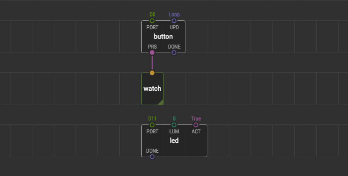
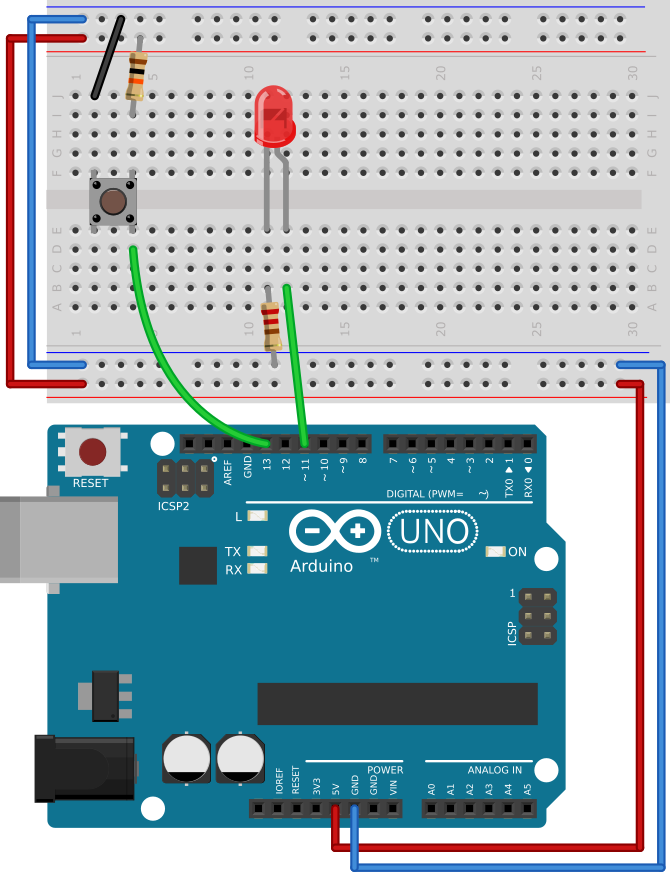

<!--
This file is auto-generated from the 'welcome-to-xod' project.
Do not change this file manually because your changes may be lost after
the tutorial update.

To make changes, change the 'welcome-to-xod' contents or 'before-1st-h2.md'.

If you want to change a Fritzing scheme or comments for it, change the
'before-1st-h2.md' in the documentation directory for the patch.

Then run auto-generator tool (xod/tools/generate-tutorial-docs.js).
-->

Note
This is a web-version of a tutorial chapter embedded right into the XOD IDE.
To get a better learning experience we recommend to install the
<a href="/downloads/">desktop IDE</a> or start the
<a href="/ide/">browser-based IDE</a>, and you’ll see the same tutorial there.

# Buttons

Here is a `button` node from `xod/common-hardware`.

Take a look at button outputs. It has a `PRS` pin, which is true whenever it is pressed. And `DONE` pin, which pulses when reading is done, wherever the button is pressed or not.

This is a standard idiom for side-effect nodes representing hardware or, for example, the Internet.

## Circuit

[↓ Download as a Fritzing project](./circuit.fzz)

## Exercise

Let's make the LED glow while the button is pressed.

1. Assemble the [circuit with a button and LED](https://xod.io/docs/tutorial/104-button/?utm_source=ide&utm_medium=ide_comment&utm_campaign=tutorial#circuit).
2. Set the `PORT` value of the `button` node to `D13` because it’s connected to the board's digital port 13.
3. Link `PRS` to `LUM`.
4. Upload your patch.

Hold the button to turn the LED on.

## Additional exercise

Place the already familiar node `flip-flop` between `button` and `led` to switch the LED on or off on each press.

  

    <a href="../103-led/">← Previous lesson</a>
  

  

    <a href="../">Index</a>
  

  

    <a href="../105-pot/">Next lesson →</a>
  

