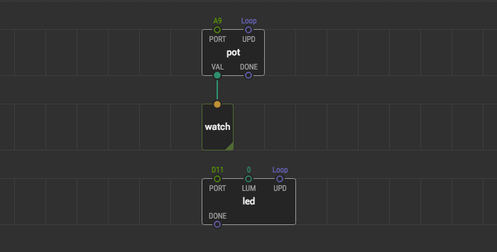
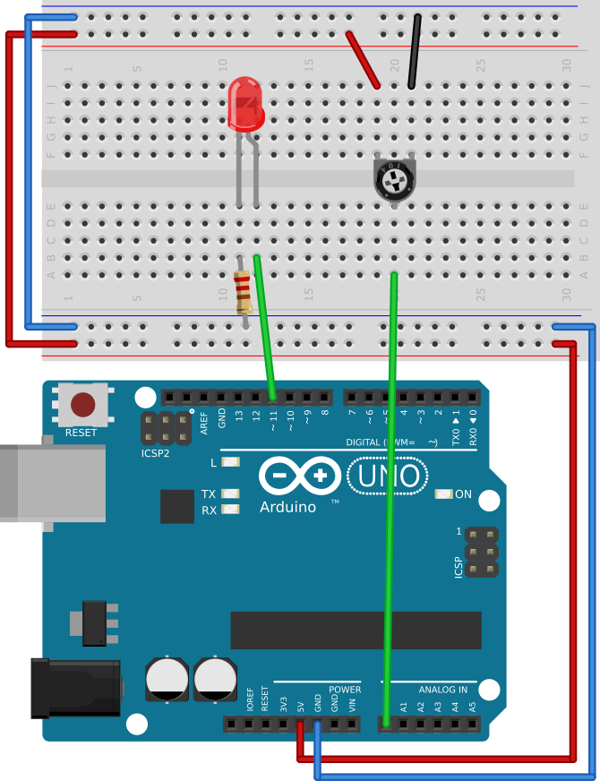

<!--
This file is auto-generated from the 'welcome-to-xod' project.
Do not change this file manually because your changes may be lost after
the tutorial update.

To make changes, change the 'welcome-to-xod' contents or 'before-1st-h2.md'.

If you want to change a Fritzing scheme or comments for it, change the
'before-1st-h2.md' in the documentation directory for the patch.

Then run auto-generator tool (xod/tools/generate-tutorial-docs.js).
-->

Note
This is a web-version of a tutorial chapter embedded right into the XOD IDE.
To get a better learning experience we recommend to install the
<a href="/downloads/">desktop IDE</a> or start the
<a href="/ide/">browser-based IDE</a>, and you’ll see the same tutorial there.

# Potentiometer

The potentiometer reads an analog value from the hardware port and outputs a normalized result in the range from `0.0` to `1.0`, depending on the angle of the knob.

It brings an easy solution to control LEDs, servos, and system coefficients.

## Circuit

[↓ Download as a Fritzing project](./circuit.fzz)

## Exercise

Let's control the brightness of the LED with a potentiometer.

1. Connect a potentiometer to the Arduino  board according to the [scheme](https://xod.io/docs/tutorial/105-pot/?utm_source=ide&utm_medium=ide_comment&utm_campaign=tutorial#circuit).

2. Set the `PORT` pin value on the `pot` node to `A0` because it’s connected to the analog board port A0.

3. Link the `pot` node `VAL` pin to the `LUM` pin on the `led` node.

4. Upload your patch.

Rotate the knob and see how the LED reacts to it. Cool, eh?

  

    <a href="../104-button/">← Previous lesson</a>
  

  

    <a href="../">Index</a>
  

  

    <a href="../106-servo/">Next lesson →</a>
  

