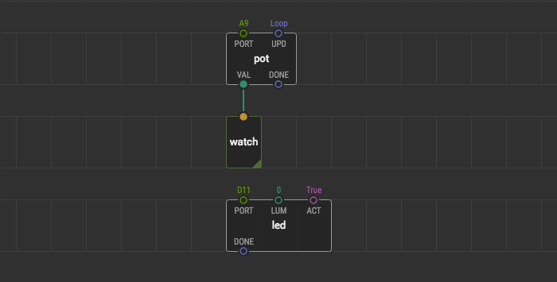
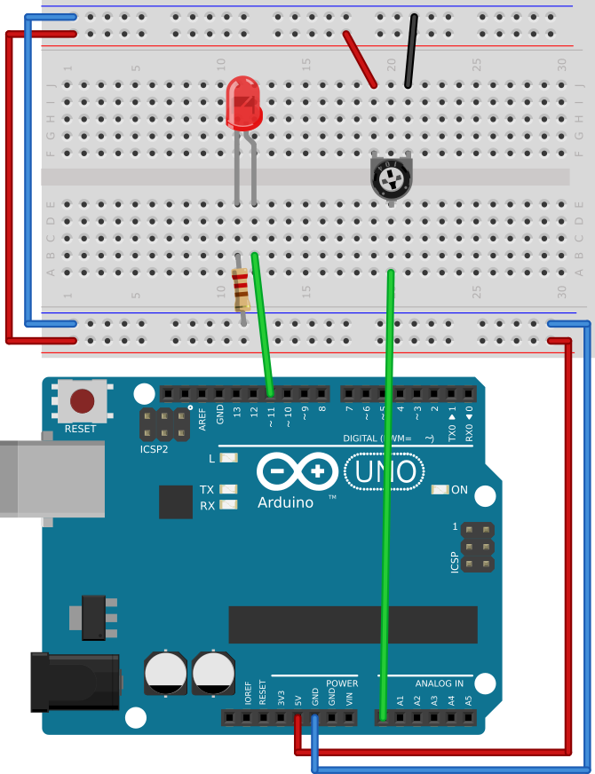

<!--
This file is auto-generated from the 'welcome-to-xod' project.
Do not change this file manually because your changes may be lost after
the tutorial update.

To make changes, change the 'welcome-to-xod' contents or 'before-1st-h2.md'.

If you want to change a Fritzing scheme or comments for it, change the
'before-1st-h2.md' in the documentation directory for the patch.

Then run auto-generator tool (xod/tools/generate-tutorial-docs.js).
-->

Примечание:
Это Веб-версия учебника, встроенная прямо в XOD IDE. Чтобы обучение проходило лучше, мы рекомендуем установить
<a href="/downloads/">стационарную версию IDE для ПК</a> или запустить
<a href="/ide/">браузерную версию IDE</a>, и вы увидите там это же руководство.

# Потенциометр

Потенциометр считывает аналоговое значение из аппаратного порта и выдает результат в диапазоне от `0.0` to `1.0`, в зависимости от угла поворота рукоятки.

Это простое решение для управления светодиодами, сервоприводами и коэффициентами системы.

## Схема

[↓ ↓ Скачать как проект Fritzing](./circuit.fzz)

## Упражнение

Давайте регулировать яркость светодиода с помощью потенциометра.

1.  Подключите потенциометр к плате Arduino согласно [схеме](https://xod.io/docs/tutorial/105-pot/?utm_source=ide&utm_medium=ide_comment&utm_campaign=tutorial#circuit).

2.  Задайте пин `PORT` ноды `pot` как `A0` т.к. потенциометр подключен к аналоговому порту A0 платы микроконтроллера.

3.  Соедините пин `VAL` ноды `pot` с пином `LUM` ноды `led`.

4.  Загрузите программу в микроконтроллер.

Поверните ручку и посмотрите, как на нее отреагирует светодиод.

  

    <a href="../104-button/">← Предыдущий</a>
  

  

    <a href="../">Оглавление</a>
  

  

    <a href="../106-servo/">Следующий урок →</a>
  

