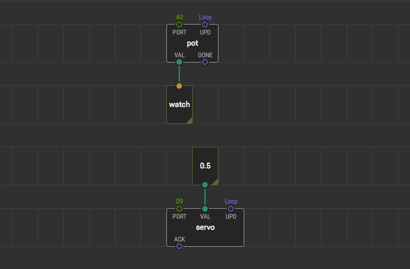

<!--
This file is auto-generated from the 'welcome-to-xod' project.
Do not change this file manually because your changes may be lost after
the tutorial update.

To make changes, change the 'welcome-to-xod' contents or 'before-1st-h2.md'.

If you want to change a Fritzing scheme or comments for it, change the
'before-1st-h2.md' in the documentation directory for the patch.

Then run auto-generator tool (xod/tools/generate-tutorial-docs.js).
-->

Note
This is a web-version of a tutorial chapter embedded right into the XOD IDE.
To get a better learning experience we recommend to install the
<a href="/downloads/">desktop IDE</a> or start the
<a href="/ide/">browser-based IDE</a>, and you’ll see the same tutorial there.

# Servo

Controlling servos in XOD is just as easy as controlling LEDs. There is a node called `servo`. Find it in `xod-dev/servo`.

The `servo` node accepts a number in the range from 0.0 to 1.0 and maps it to the rated arm rotation limits of the servo motor.

## Circuit

[↓ Download as a Fritzing project](./circuit.fzz)

## Exercise

Let's link `pot` with `servo` to control the servo angle with the potentiometer.

1. Connect a servo to the Arduino board as shown on the [scheme](https://xod.io/docs/tutorial/106-servo/?utm_source=ide&utm_medium=ide_comment&utm_campaign=tutorial#circuit).

2. Link the `VAL` pin of the `pot` node to the `VAL` pin of the `servo` node.

3. Upload the patch to the board.

Turn the potentiometer knob, and watch the servo turns.

## 👆 Motors are power hogs

If you wiggle the potentiometer fast enough you can encounter board reboots. It is because motors consume a lot of power when accelerate and if powered from the same power line as the microcontroller, the latter is left with no power at all.

To fight the effect in hardware, decouple digital parts of the circuit with capacitors and DC/DC converters. Use efficient power supplies along with (or instead of) your PC USB.

To deal with it in software, start and stop motors slowly. `206-fade` gives one possible way to acheive it.

  

    <a href="../105-pot/">← Previous lesson</a>
  

  

    <a href="../">Index</a>
  

  

    <a href="../107-manipulator/">Next lesson →</a>
  

