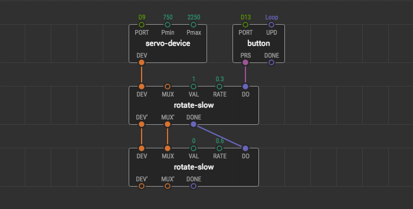
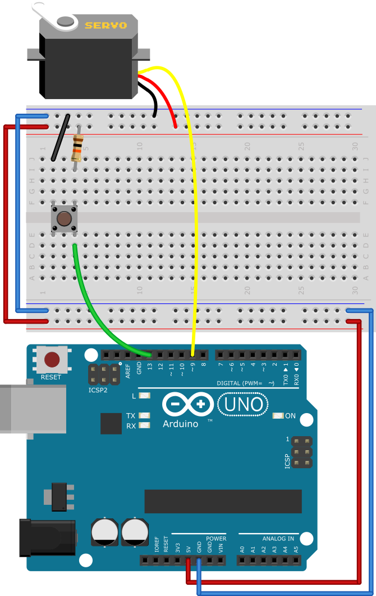

<!--
This file is auto-generated from the 'welcome-to-xod' project.
Do not change this file manually because your changes may be lost after
the tutorial update.

To make changes, change the 'welcome-to-xod' contents or 'before-1st-h2.md'.

If you want to change a Fritzing scheme or comments for it, change the
'before-1st-h2.md' in the documentation directory for the patch.

Then run auto-generator tool (xod/tools/generate-tutorial-docs.js).
-->

Note
This is a web-version of a tutorial chapter embedded right into the XOD IDE.
To get a better learning experience we recommend to install the
<a href="/downloads/">desktop IDE</a> or start the
<a href="/ide/">browser-based IDE</a>, and you’ll see the same tutorial there.

# Manipulator

Controlling the servo with a potentiometer or another analog sensor is easy. However, what if we want to make some complex movements with servos?

On the patch board, you see `servo-device`. This node defines a servo for the further usage: the port, minimum, and maximum pulse widths which correspond to the operating limits of the servo.

The `servo-device` node links to nodes that work with servos: `rotate-slow` in this example. The `rotate-slow` node rotates the servo to the angle specified in `VAL` with the `RATE` speed when a `DO` pulse is received. You may chain these nodes to make a sequential movement.

You may notice that `rotate-slow` have `MUX` pins. It's another custom type called `mutex` that allows only one node to act at the same time.

This program rotates the servo to the maximum angle slowly and then turn it back twice as fast on a button press. The button is ignored until rotation completes.

Upload the program and check it out.

## Circuit

Note
The circuit is the same as for the previous lesson.

[↓ Download as a Fritzing project](./circuit.fzz)

## Exercise

Let's change the servo trajectory.

1.  Add two more `rotate-slow` nodes.
2.  Link all nodes in the same way.
3.  Adjust pin values of `rotate-slow`.
4.  Upload the program.

Press the button and see how the servo fulfills your order.

## 👆 Simple nodes vs device nodes

The `xod-dev/servo` library also contains a `rotate` node. The main difference between it and `rotate-slow` that it rotates the servo immediately ignoring `MUX`.

And if you wonder how the simple `servo` node used in the previous chapter works: under the hood, it is a trivial composition of `servo-device` and `rotate` with a few terminals exposed to you. Simple nodes (also known as quickstart nodes) are enough for basic applications and when you need more, you use raw device nodes along with action nodes like you do in this chapter.

This idiom is applicable to other hardware as well.

  

    <a href="../106-servo/">← Previous lesson</a>
  

  

    <a href="../">Index</a>
  

  

    <a href="../108-text-lcd/">Next lesson →</a>
  

