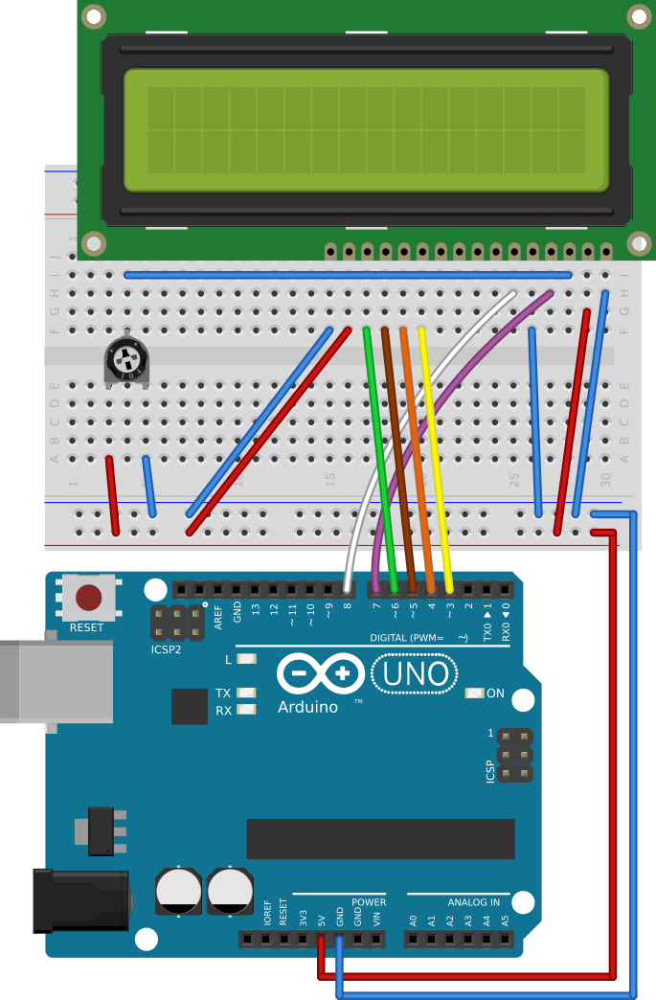
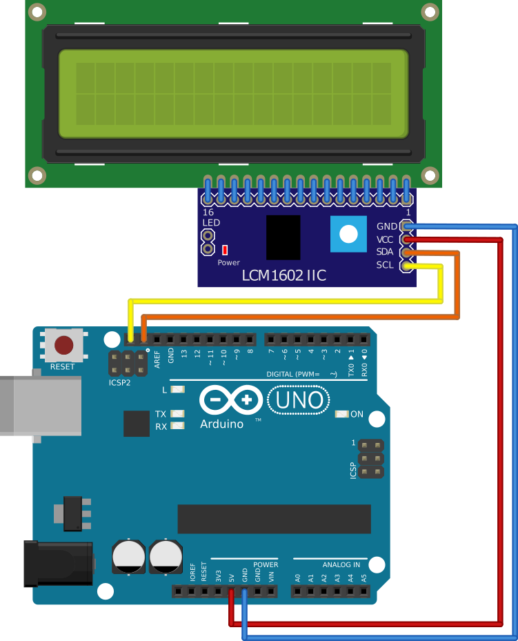

<!--
This file is auto-generated from the 'welcome-to-xod' project.
Do not change this file manually because your changes may be lost after
the tutorial update.

To make changes, change the 'welcome-to-xod' contents or 'before-1st-h2.md'.

If you want to change a Fritzing scheme or comments for it, change the
'before-1st-h2.md' in the documentation directory for the patch.

Then run auto-generator tool (xod/tools/generate-tutorial-docs.js).
-->

Note
This is a web-version of a tutorial chapter embedded right into the XOD IDE.
To get a better learning experience we recommend to install the
<a href="/downloads/">desktop IDE</a> or start the
<a href="/ide/">browser-based IDE</a>, and you’ll see the same tutorial there.

# Display Text on LCD

There are many variants of liquid crystal displays (LCD). Among them, text displays are simplest to communicate with. A text LCD can expose either of physical interfaces:

- I2C
- Parallel

XOD supports both.

## Circuit (parallel interface)

[↓ Download as a Fritzing project](./parallel-interface.fzz)

## Circuit (I2C interface)

[↓ Download as a Fritzing project](./i2c-interface.fzz)

## Exercise

Let’s show some text on an LCD.

1. Examine your LCD and decide which node fits it. Remove another one.
2. Assemble the [circuit](https://xod.io/docs/tutorial/108-text-lcd/?utm_source=ide&utm_medium=ide_comment&utm_campaign=tutorial#circuit) that matches your LCD model.
3. Bind pins or set the I2C address.
4. Bind "Wuzzup!" to the `L1` pin.
5. Link `tweak-string` with `L2`.
6. Upload the patch with the interactive session enabled.
7. Select `tweak-string`.
8. Type some text and press the Enter key.

## 👆 Too many variations

The world of text LCDs is too wide to guess your LCD pinout and parameters. The provided circuit will work for some models, but not for others. Refer to your particular display documentation to precisely determine its address, data pinout, contrast pin wiring, digital and backlight powering scheme.

For the rest of the tutorial we assume you have an I²C LCD listening on 27h address. Adjust patches accordingly if you’ve got another model.

  

    <a href="../107-manipulator/">← Previous lesson</a>
  

  

    <a href="../">Index</a>
  

  

    <a href="../109-thermometer/">Next lesson →</a>
  

