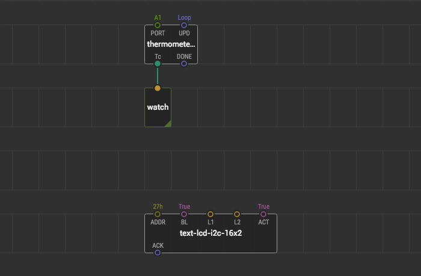

<!--
This file is auto-generated from the 'welcome-to-xod' project.
Do not change this file manually because your changes may be lost after
the tutorial update.

To make changes, change the 'welcome-to-xod' contents or 'before-1st-h2.md'.

If you want to change a Fritzing scheme or comments for it, change the
'before-1st-h2.md' in the documentation directory for the patch.

Then run auto-generator tool (xod/tools/generate-tutorial-docs.js).
-->

Note
This is a web-version of a tutorial chapter embedded right into the XOD IDE.
To get a better learning experience we recommend to install the
<a href="/downloads/">desktop IDE</a> or start the
<a href="/ide/">browser-based IDE</a>, and you’ll see the same tutorial there.

# Thermometer

What if you need to control the ambient air temperature?

A popular chip to measure temperature is TMP36 thermometer. XOD has a node `thermometer-tmp36` for this IC in `xod/common-hardware`. It outputs the temperature in degrees Celsius.

## Circuit

[↓ Download as a Fritzing project](./circuit.fzz)

## Exercise

Showing static text on the LCD is boring. So let's make a smarter device and show the temperature on the LCD.

1.  Add a thermometer to your [circuit as shown](https://xod.io/docs/tutorial/109-thermometer/?utm_source=ide&utm_medium=ide_comment&utm_campaign=tutorial#circuit).

2.  Ensure the correct `PORT` for the `thermometer-tmp36` node.

3.  Link `Tc` of `thermometer-tmp36` with `L1` of `text-lcd-16x2-i2c`.

4.  Upload your patch.

Now you have a portable thermometer.

## 👆 Output formatting

You can convert Celsius to Fahrenheit using `xod/units/c-to-f` node.

Moreover, you can add a `concat` node and show the temperature on the display like "22C" instead of a plain number. See `210-string-formatting` for more details.

  

    <a href="../108-text-lcd/">← Previous lesson</a>
  

  

    <a href="../">Index</a>
  

  

    <a href="../110-ldr/">Next lesson →</a>
  

