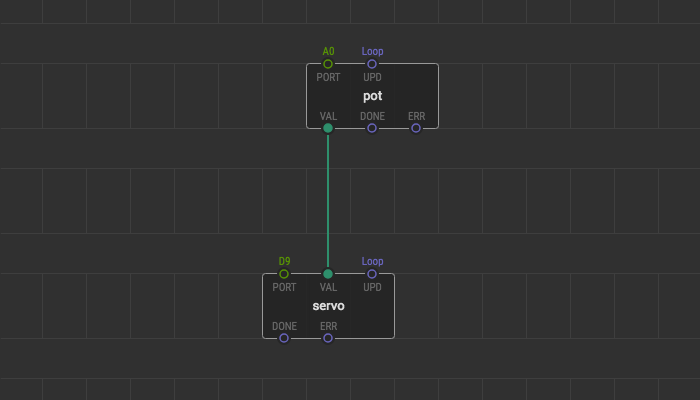

# #11. Управление сервоприводом

Примечание
Это веб-версия обучения, встроенная прямо в XOD IDE.
Для удобства обучения, мы рекомендуем установить
<a href="/downloads/">desktop IDE</a> или открыть
<a href="/ide/">browser-based IDE</a>, и вы увидите тот же учебник.

Управлять сервоприводом в XOD также легко,как и светодиодом. Есть
специальная нода, называется `servo`. Вы найдете её в `xod/common-hardware`.

Пин `PORT` указывет цифровой порт на плате Arduino куда подключен сервопривод. 
Пин `VAL` принимает значения от 0 до 1, он поворачивает сервопривод на угол от 0 до 180°.

## Схема

[↓Скачать Fritzing проект](./circuit.fzz)

## Как использовать

1.  Добавьте ноду `servo` в патч
2.  Задайте значение пина `PORT`
3.  Соедините входной пин `VAL` с выходным пином другой ноды, обеспечивающей значения в диапазоне 0–1.

Поверните ручку потенциометра и следите за поворотом сервопривода!!
