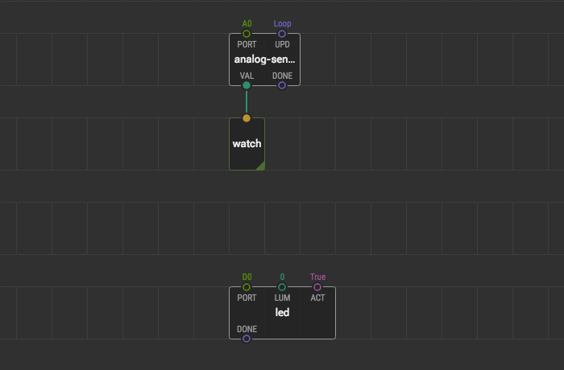
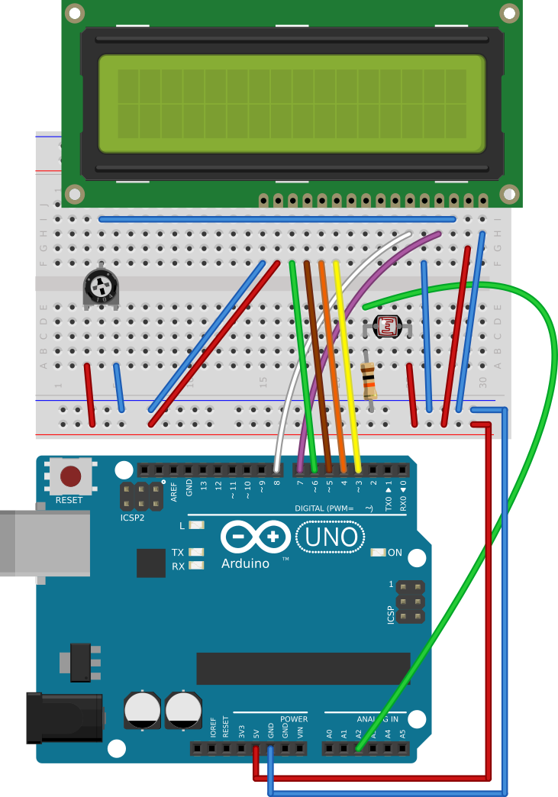

<!--
This file is auto-generated from the 'welcome-to-xod' project.
Do not change this file manually because your changes may be lost after
the tutorial update.

To make changes, change the 'welcome-to-xod' contents or 'before-1st-h2.md'.

If you want to change a Fritzing scheme or comments for it, change the
'before-1st-h2.md' in the documentation directory for the patch.

Then run auto-generator tool (xod/tools/generate-tutorial-docs.js).
-->

Note
This is a web-version of a tutorial chapter embedded right into the XOD IDE.
To get a better learning experience we recommend to install the
<a href="/downloads/">desktop IDE</a> or start the
<a href="/ide/">browser-based IDE</a>, and you’ll see the same tutorial there.

# Ambient Light Sensor

Let’s introduce a new sensor to measure the ambient light level. A photoresistor (aka light dependent resistor or LDR) will do a great job of measuring the parameter. However, there is a small problem: we do not have a photoresistor node in XOD.

We have basic nodes for working with digital and analog ports though. The photoresistor is a pretty primitive device, and all we need to do is read its value from the analog port. To do so, use an `analog-sensor` node.

## Circuit

[↓ Download as a Fritzing project](./circuit.fzz)

## Exercise

Let’s make a smart (or dumb) light bulb.

1.  Assemble the [circuit with an LDR and LED](https://xod.io/docs/tutorial/110-ldr/?utm_source=ide&utm_medium=ide_comment&utm_campaign=tutorial#circuit).

2.  Link the `VAL` output pin of the `analog-sensor` node to the `LUM` pin of the `led` node.

3.  Upload the patch to the board.

Cover the photoresistor with your hand and watch how the brightness of the LED changes.

  

    <a href="../109-thermometer/">← Previous lesson</a>
  

  

    <a href="../">Index</a>
  

  

    <a href="../200-patterns/">Next lesson →</a>
  

