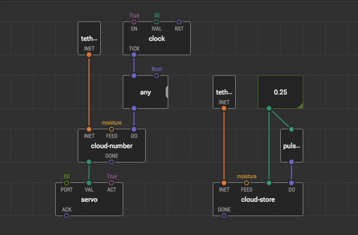

<!--
This file is auto-generated from the 'welcome-to-xod' project.
Do not change this file manually because your changes may be lost after
the tutorial update.

To make changes, change the 'welcome-to-xod' contents or 'before-1st-h2.md'.

If you want to change a Fritzing scheme or comments for it, change the
'before-1st-h2.md' in the documentation directory for the patch.

Then run auto-generator tool (xod/tools/generate-tutorial-docs.js).
-->

Note
This is a web-version of a tutorial chapter embedded right into the XOD IDE.
To get a better learning experience we recommend to install the
<a href="/downloads/">desktop IDE</a> or start the
<a href="/ide/">browser-based IDE</a>, and you’ll see the same tutorial there.

# Feed Messaging

In this chapter, we’ll make an analog gauge for the data that is pushed to the cloud in the same way you already saw in one of the previous chapters.

The `xod-cloud/feeds` standard library provides nodes to retrieve the last value from your feed with different types: `cloud-boolean`, `cloud-string`, and `cloud-number`. Since we're sending number values, we pick `cloud-number`.

On the left side, nodes react to the data changes by rotating a servo. On the right side, you see nodes to update the value and check out how your servo responds.

Note that on both sides, we named the feed as "moisture", they should match. Usually, the moisture is measured as a percentage. So we expect values in a range from 0.00 to 1.00. If you use another range, place the `map` node before the `VAL` input of a `servo` node.

## Excercise

1.  Bind a proper `PORT` to the `servo` node
2.  Upload the program with the debug mode turned on.
3.  Update `tweak-number` value and check out how your servo responds.
4.  Place a `map` node between `cloud-number` and `servo` if needed.

Now you got a remote analog gauge for the data that you send to the cloud. You can place it on your desktop and watch for the moisture in your greenhouse located far away.

You might build another device to switch a water pump in response to the same data feed changes. Moreover, you could send the status of the water pump to the cloud to see if the pump is working.

Use the `tweak-number` node to update the value.

  

    <a href="../110-ldr/">← Previous lesson</a>
  

  

    <a href="../">Index</a>
  

  

    <a href="../112-standalone-internet/">Next lesson →</a>
  

