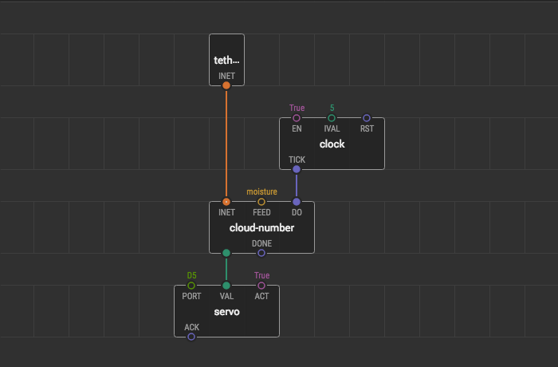

<!--
This file is auto-generated from the 'welcome-to-xod' project.
Do not change this file manually because your changes may be lost after
the tutorial update.

To make changes, change the 'welcome-to-xod' contents or 'before-1st-h2.md'.

If you want to change a Fritzing scheme or comments for it, change the
'before-1st-h2.md' in the documentation directory for the patch.

Then run auto-generator tool (xod/tools/generate-tutorial-docs.js).
-->

Note
This is a web-version of a tutorial chapter embedded right into the XOD IDE.
To get a better learning experience we recommend to install the
<a href="/downloads/">desktop IDE</a> or start the
<a href="/ide/">browser-based IDE</a>, and you’ll see the same tutorial there.

# Stand-alone Internet

It's time to make your device autonomous.

Here is the program from the previous chapter. The program has a `tethering-inet` node that depends on PC and works only in the debug mode. To make a stand-alone device, replace it with another node that provides the internet using some hardware module, shield, or the native microcontroller features.

For such purposes XOD has a few standard libraries:

- [`xod-dev/esp8266-mcu`](https://xod.io/libs/xod-dev/esp8266-mcu/?utm_source=ide&utm_medium=ide_comment&utm_campaign=tutorial) — if you run the program on ESP8266,
- [`xod-dev/esp8266`](https://xod.io/libs/xod-dev/esp8266/?utm_source=ide&utm_medium=ide_comment&utm_campaign=tutorial) — if you run the program on the microcontroller without onboard WiFi module, but using an ESP8266 as an AT command modem,
- [`xod-dev/w5500`](https://xod.io/libs/xod-dev/w5500/?utm_source=ide&utm_medium=ide_comment&utm_campaign=tutorial) — if you have an ethernet shield based on W5500 chipset.

Each of the libraries has a set of some low-level networking nodes. But for the current case, you only need the internet provider node.

Here are these nodes:

- `xod-dev/esp8266-mcu/connect`
- `xod-dev/esp8266/connect`
- `xod-dev/w5500/ethernet-shield`

## Excercise

1.  Replace the `tethering-inet` node with a suitable one from the list above.
2.  Bind the appropriate values to the node inputs such as the name of your WiFi access point and password.
3.  Bind the `PORT` value to `servo` node.
4.  Upload the patch without debug mode.

Note that you need to log in and generate a XOD Cloud API key for the project if you haven't done it before (hit Edit → Project Preferences).

The servo rotates to the angle that corresponds to the latest "moisture" value. Now you can open the chapter `015-xod-cloud` again, run the simulation and control your gauge from XOD IDE over the cloud. Or you can make another device, which updates this value automatically.

---

In some cases, you might need to make an advanced configuration of the connected module or ethernet-shield. Check out examples in the library or read an article about [ethernet-shield advanced configuration](https://xod.io/docs/guide/w5500-advanced/?utm_source=ide&utm_medium=ide_comment&utm_campaign=tutorial).

  

    <a href="../111-feed-messaging/">← Previous lesson</a>
  

  

    <a href="../">Index</a>
  

  

    <a href="../200-patterns/">Next lesson →</a>
  

