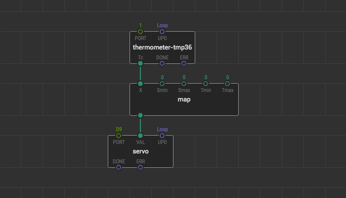

# #13. Сопоставление значений

Примечание
Это веб-версия обучения, встроенная прямо в XOD IDE.
Для удобства обучения, мы рекомендуем установить
<a href="/downloads/">desktop IDE</a> или открыть
<a href="/ide/">browser-based IDE</a>, и вы увидите тот же учебник.

Если вы читали страницу документации ноды термометра, то вы наверняка заметили, что нода 
выдает значение температуры на выходной пин `Tc` в градусах Цельсия. 
Если мы собираемся показать температуру с помощью стрелки, управляемой сервоприводом, то у 
нас возникает сложность, связанная с тем, что нода `servo` может работать только со значениями от 0 до 1
(0 это 0°, 1 это 180°).
Практическая задача состоит в том, чтобы сервопривод плавно вращался от 0° до 90°,
отражающие изменение температуры от 20°C до 50°C.

На самом деле вы можете сделать это, используя несколько математических нод, но XCODE имеет 
специальную ноду для этих случаев. Эта нода называется `map` нодой.

Нода имеет пины:

- `X` — входное значение, которое необходимо преобразовать;
- `Smin` — нижняя граница входного диапазона;
- `Smax` — верхняя граница входного диапазона;
- `Tmin` — нижняя граница преобразованного значения;
- `Tmax` — верхняя граница преобразованного значения;
- `Xm` — отображенное (преобразованное) значение.

Правильная их настройка сопоставит входные данные из одного диапазона с выходными данными в 
необходимом нам диапазоне.

## Схема

Примечание
Схема, как и в прошлом примере

[↓Скачать Fritzing проект](./circuit.fzz)

## Как использовать

1.  Добавьте ноду `xod/math/map` в ваш патч..
2.  Свяжите входные данные`X` со значением для сопоставления.
3.  Установите границы входного (исходного) диапазона с помощью `Smin` and `Smax` (например, 20 и 50).
4.  Установите выходные (целевые) границы диапазона с `Tmin` and `Tmax` (например, 0 и 0,5).
5.  Используйте `Xm` в качестве результирующего значения в новом диапазоне.

Если вы следовали примеру, то попробуйте нагреть термометр горячим предметом.  
При температуре 35°C (половина диапазона входного сигнала), сервопривод должен вращаться на 45°, 
что составляет половину выходного диапазона.
