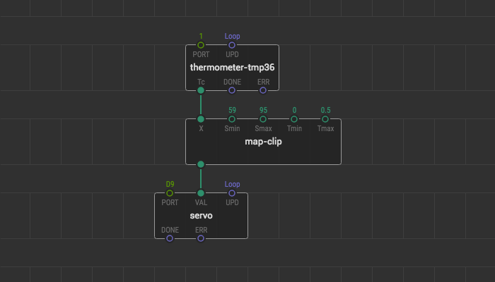

# #14. Настройка сопоставления диапазонов значений

Примечание
Это веб-версия обучения, встроенная прямо в XOD IDE.
Для удобства обучения, мы рекомендуем установить
<a href="/downloads/">desktop IDE</a> или открыть
<a href="/ide/">browser-based IDE</a>, и вы увидите тот же учебник.

После предыдущего урока нода `map` позволила линейно отображать диапазон 20-50°C на
0-90° вращение сервопривода. Давайте повысим чувствительность. Скажем, мы хотим отобразить 15-30°C , а угол вращения сервопривода был 0-90° .

Однако, что произойдет, если пин `X` ноды `map` получает значения, выходящие за пределы диапазона (10 или 42, для примера)? Выходное значение, которое является углом поворота сервопривода тогда примет значения вне диапазона.

Для таких случаев есть одноуровневая нода, называемая `map-clip`. ,
Это работает так же, но любое входное значение, который находится вне диапазона, будет округлен до `Smin` или `Smax`. Таким образом, если `X` получает значение 10, то нода `map-clip` принимает значение 15, а значение 42 будет принято, как 30.

## Схема

Примечание
Схема, как и в прошлом примере

[↓Скачать Fritzing проект](./circuit.fzz)

## Как использовать

Просто используйте `map-clip` вместо  `map` если вы хотите, чтобы выходной диапазон был
строго ограничен.

Если вы предпочитаете °F, то вы можете легко перевести данные от термометра с нодой `c-to-f` из `xod/units`. Диапазон будет 59-95°F.

