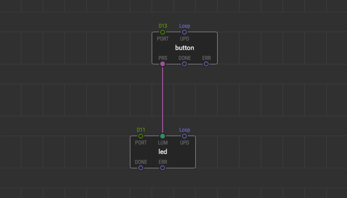

# #15. Кнопки

Примечание
Это веб-версия обучения, встроенная прямо в XOD IDE.
Для удобства обучения, мы рекомендуем установить
<a href="/downloads/">desktop IDE</a> или открыть
<a href="/ide/">browser-based IDE</a>, и вы увидите тот же учебник.

Итак, кнопки! Они могут быть использованы с помощью ноды `button` из `xod/common`.
Нода делает все работы, связанные с «дребезгом» сигнала, так что вам не нужно
беспокойся об этом.

Кнопки имеют фиолетовый выходной пин, называемый `PRS`. Этот пин возвращает тип данных: _boolean_.

Boolean данные могут нести только два значения: правда (true) или ложь (false). 
В нашем слуачаем нода `button` возвращает значение `false` в режиме ожидания и значение `true` когда кнопка нажата.

Хорошие новости, в xod boolean и числовые типы данных совместимы. 
Есть два правила передачи данных:
- Boolean-в-число: если вы посылаете boolean false на числовой (зеленый) вход, он
  будет интерпретироваться как числовой 0; Если вы посылаете логическое значение true, оно будет интерпретироваться как число 1.
- Число-в-boolean: при отправке любого числового значения, кроме 0 на  boolean (фиолетовый) пин; он будет интерпретироваться как true. Если вы отправите 0, он будет интерпретироваться как false.

## Схема

[↓Скачать Fritzing проект](./circuit.fzz)

## Как использовать

Давайте свяжем кнопку со светодиодом.

1.  Добавить ноду `xod/common-hardware/button`.
2.  Задайте значение пина `PORT`.
3.  Соедините кнопку `PRS` с пином назначения (`LUM` пина `led` в нашем примере).

Теперь, когда вы нажимаете кнопку `button` нода  на пине`PRS` меняет значение на `true`,
И отправляет значение на `led` ноду (пин `LUM`), там значение интерпретируется , как 1, и светодиод загорается.
