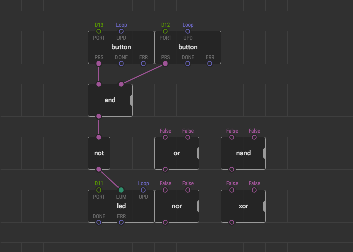

# #16. Логические ноды

Примечание
Это веб-версия обучения, встроенная прямо в XOD IDE.
Для удобства обучения, мы рекомендуем установить
<a href="/downloads/">desktop IDE</a> или открыть
<a href="/ide/">browser-based IDE</a>, и вы увидите тот же учебник.

Логические значения (Boolean) - это круто. Их можно использовать для построения сложных логических систем. В XOD, вы найдете много нод для этих целей. Все они расположены в
`xod/core`.

- `and` (и) возвращает `true` (правда), если оба входных пина (`IN1` _и_ `IN2`) `true` (правда)
- `or` (или) возвращает `true` (правда), если хотя бы один из `IN1`, `IN2`, соответствует `true` (правда)
- `xor` (исключение) возвращает `true` если только один из `IN1` and `IN2` соответствует `true`
- `not` (инверсия) инвертирует входное значение
- `nand` полная противоположность ноды `and`
- `nor` полная противоположность ноды `or`

## Схема

[↓Скачать Fritzing проект](./circuit.fzz)

В примере патча выше`and` нода возвращает `false` пока обе кнопки
нажаты. Нода `not` инвертирует значение из ноды `and`, поэтому на пине `LUM` получается значение `true` (1). Таким образом, светодиод включается.

Нажатие одной из кнопок ничего не меняет. Светодиод погаснет только когда
пин `LUM` примет значение false (0). Это произойдет, только если нода `not` получит
значение true, которое возможно только при одновременном нажатии обеих кнопок.
