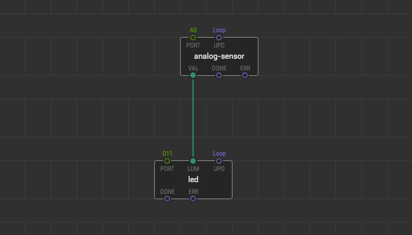

# #17. Чтение датчика освещенности

Примечание
Это веб-версия обучения, встроенная прямо в XOD IDE.
Для удобства обучения, мы рекомендуем установить
<a href="/downloads/">desktop IDE</a> или открыть
<a href="/ide/">browser-based IDE</a>, и вы увидите тот же учебник.

Добавим новый датчик для измерения уровня освещенности. Фоторезистор
(светозависимый резистор или LDR) будет измерять освещенность. 
Однако есть небольшая проблема: у нас нет ноды фоторезистора в XOD.

Тем не менее, у нас есть базовые ноды для работы с цифровыми и аналоговыми портами
Arduino. Фоторезистор-довольно примитивное устройство, и все, что нам нужно сделать, это
читать ее значение из аналогового порта на Arduino. Для этого мы будем использовать
ноду `analog-sensor`.

Это простенькая нода, которая считывает значения с аналогового порта Arduino и передаёт выходное значение в диапазоне 0–1, 
где 0 соответсвует напряжению 0 В, а 1 соответствует напряжению тока 5 В (или 3,3 В; значение 1023 в C++)
## Схема

[↓Скачать Fritzing проект](./circuit.fzz)

Попробуйте создать устройство, как показано выше, накройте фоторезистор рукой,
и наблюдайте как меняется яркость светодиода.
