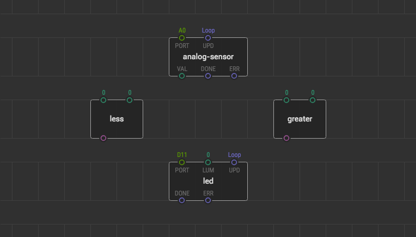

# #18. Сравнение значений

Примечание
Это веб-версия обучения, встроенная прямо в XOD IDE.
Для удобства обучения, мы рекомендуем установить
<a href="/downloads/">desktop IDE</a> или открыть
<a href="/ide/">browser-based IDE</a>, и вы увидите тот же учебник.

Теперь давайте научимся работать с выражениями условий в XOD.

Мы измерим уровень освещенности, и если значения превышают или ниже
Установленного порога, то мы включим или выключим светодиод.

XOD имеет `greater` (больше чем) и  `less` (меньше чем) ноды, чтобы выполнять простые математические сравнения. Они расположены в `xod/core`.

Слева в  `IN1` и справа в `IN2` вводим значения для сравнения, а на выходном пине
`OUT` возвращает результат сравнения, выраженный в виде логического значения (true или
false).

## Схема

Примечание
Схема, как и в предыдущем уроке.

[↓Скачать Fritzing проект](./circuit.fzz)

## Как использовать

- поместите ноду `xod/core/less` (или `greater`)  чтобы вызвать действие, когда
  измеренный параметр выше (или ниже) порогового значения.
- Используйте пин слева, чтобы соединить измеренное значение.
- Задайте пороговое значение на правом пине.
- В тех случаях, когда выставить точный порог срабатывания сложно, используйте значения из
  потенциометр для динамической регулировки.

В показанном примере, если нода `analog-sensor` (наш фоторезистор) возвратит значение больше порогового значения ноды `greater`, то на пине `OUT` установиться значение `true`, и светодиод включится.

