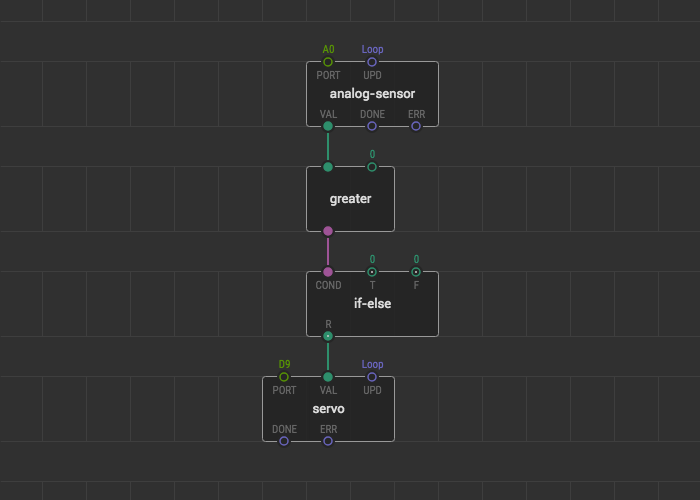

# #19. Условие ЕСЛИ

Примечание
Это веб-версия обучения, встроенная прямо в XOD IDE.
Для удобства обучения, мы рекомендуем установить
<a href="/downloads/">desktop IDE</a> или открыть
<a href="/ide/">browser-based IDE</a>, и вы увидите тот же учебник.

Все ноды сравнения возвращают true или false.

Давайте представим, что Вам необходимо повернуть сервопривод на определенный угол, например до 45°, когда вы получаете true, и до 135°, когда вы получаете false. Как можем мы
это сделать??

В `xod/core` есть нода `if-else`. Пин `COND` этой ноды проверяет логическое входное значение. 
Если `COND` получает true, то нода устанавливает на пине `R` значение из пина `T`
Если получает false, то на пине `R` будет значение из пина `F`.

Теперь просто установите значение `T` на 0.25 и`F` на 0, чтобы проследить, как это работает.

## Схема

[↓Скачать Fritzing проект](./circuit.fzz)
	
Теперь, если нода `if-else` принимает значение  true, сервопривод повернется на угол пина `T` иначе на угол пина `F`.

