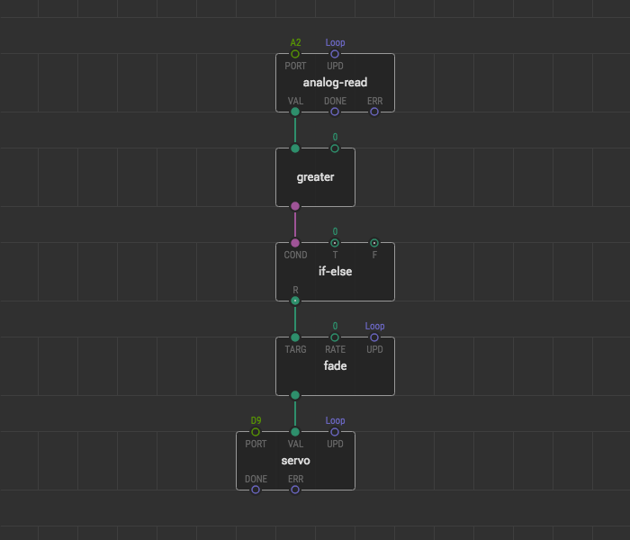

# #20. Плавные изменения значений

Примечание
Это веб-версия обучения, встроенная прямо в XOD IDE.
Для удобства обучения, мы рекомендуем установить
<a href="/downloads/">desktop IDE</a> или открыть
<a href="/ide/">browser-based IDE</a>, и вы увидите тот же учебник.

В предыдущих примерах серво поворачивается на заданный угол на максимальной скорости.
Быстрый ход не всегда необходим и может повредить сервопривод, например, если вал
врежется в препятствие.
Давайте улучшим наш патч, заставив серво двигаться более плавно. Для этого,
нам будет нужно установить значение пина `VAL` через промежуточные  значения. 
Для этого есть нода, и он называется `fade`.

Нода `fade` расположена в `xod/core`. Эта нода устанавливает ряд
промежуточных значений, поэтому эта нода сгладит наше движение сервопривода.

- пин `TARG` ожидает целевое значение.
- пин `RATE` определяет количество в секунду промежуточных изменений для плавного хода

Выходной пин возвращает 0 в начале программы. Затем он начинает двигаться
в сторону значения `TARG` с шагом `RATE`. Значение выходного пина
сохраняется, поэтому, если `TARG` значение меняется, то выходные значения также будут двигаться к этому значению из последнего возвращенного значения.

## Схема

Примечание
Схема, как и в прошлом уроке.

[↓Скачать Fritzing проект](./circuit.fzz)

Теперь сервопривод будет вращаться со скоростью 18° в секунду (0.1 = 18°).
