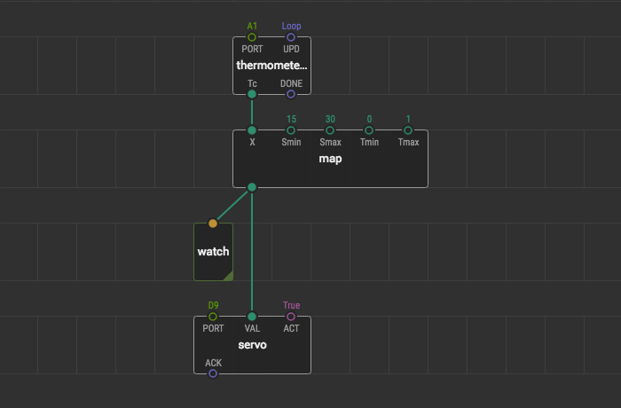

<!--
This file is auto-generated from the 'welcome-to-xod' project.
Do not change this file manually because your changes may be lost after
the tutorial update.

To make changes, change the 'welcome-to-xod' contents or 'before-1st-h2.md'.

If you want to change a Fritzing scheme or comments for it, change the
'before-1st-h2.md' in the documentation directory for the patch.

Then run auto-generator tool (xod/tools/generate-tutorial-docs.js).
-->

Note
This is a web-version of a tutorial chapter embedded right into the XOD IDE.
To get a better learning experience we recommend to install the
<a href="/downloads/">desktop IDE</a> or start the
<a href="/ide/">browser-based IDE</a>, and you’ll see the same tutorial there.

# Matching Ranges

If you have finished `109-thermometer`, you have noticed that the thermometer node outputs the temperature value to the `Tc` pin in degrees Celsius.

The practical task is to make the servo rotate smoothly from 0 to 90°, reflecting a temperature change from 20 °C to 50 °C.

The `servo` node can work only with values ranging from 0 to 1. You can match the ranges using a few math nodes, but XOD gives a special node for such cases. This node is called `map`.

## Exercise

Make a device which shows the temperature with an arrow glued to the servo shaft.

1.  Connect a TMP36 thermometer to the board as shown on the [scheme](https://xod.io/docs/tutorial/201-matching-ranges/?utm_source=ide&utm_medium=ide_comment&utm_campaign=tutorial#circuit).

2.  Link the `Tc` pin to the `X` pin on the `map` node.

3.  Define the input range: open the Inspector for `map`, and then set `Smin` to 20 and `Smax` to 50.

4.  Define the output range: set the `Tmin` to 0 and `Tmax` to 0.5 (which corresponds to ~90°).

5.  Link the `Xm` output to the `VAL` servo input.

Try to heat the thermometer with a hot object (e.g., a paper knife heated with a lighter). At the temperature of 35 °C (half the input range), the servo should rotate to 45°, which is the midpoint of the output range.

## Clipping ranges

The `map` node will now linearly map the 20–50 °C range to 0–90°. Let’s raise the sensitivity. Say, we want to map 15–30 °C to 0–90° rotation.

What happens if the `X` pin of the `map` receives data that is outside the input range (10 or 42, for example)? The output value which is the servo angle proportionally falls outside the desired range too.

For such cases, there is a sibling node called `map-clip`. It works the same way, but any input that is out of the range rounds to the nearest limit. Thus, if `X` receives the value of 10, the `map-clip` node accepts it as 15, and 42 as 30.

## Extra exercise

Replace the `map` node with `map-clip` and try the out-of-range values.

Replace the thermometer with `analog-sensor` for LDR and play with values.

Draw a gauge on the paper and attach it to the servo.

  

    <a href="../200-patterns/">← Previous lesson</a>
  

  

    <a href="../">Index</a>
  

  

    <a href="../202-alarm/">Next lesson →</a>
  

