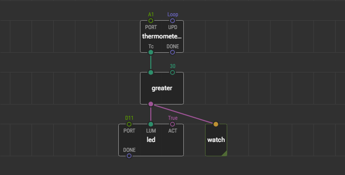

<!--
This file is auto-generated from the 'welcome-to-xod' project.
Do not change this file manually because your changes may be lost after
the tutorial update.

To make changes, change the 'welcome-to-xod' contents or 'before-1st-h2.md'.

If you want to change a Fritzing scheme or comments for it, change the
'before-1st-h2.md' in the documentation directory for the patch.

Then run auto-generator tool (xod/tools/generate-tutorial-docs.js).
-->

Note
This is a web-version of a tutorial chapter embedded right into the XOD IDE.
To get a better learning experience we recommend to install the
<a href="/downloads/">desktop IDE</a> or start the
<a href="/ide/">browser-based IDE</a>, and you’ll see the same tutorial there.

# Alarm

Here is the program of a simple alarm device, which turns the LED on when the temperature gets higher than the desired value.

As you can note, we use the `greater` node, one of the comparison nodes from the XOD standard library.

## Exercise

Change the logic to make the alarm working whenever the temperature gets _lower_ than the threshold. Let the user to set this value using a potentiometer.

1.  Replace the `greater` node with `less`.

2.  Place the `map` node and bind values to map 0.0...1.0 range to 15...30 degrees Celsius.

3.  Place `pot` and bind the corresponding `PORT`.

4.  Link `pot`, `map`, and `less` nodes.

5.  Upload the program.

Rotate the potentiometer knob to set the threshold. Heat and cool down the thermometer to see how it works.

## Additional exercise

Use both `greater` and `less` nodes to alarm only when the temperature is out of the range. Hint: you need the `or` node.

  

    <a href="../201-matching-ranges/">← Previous lesson</a>
  

  

    <a href="../">Index</a>
  

  

    <a href="../203-permanent-alarm/">Next lesson →</a>
  

