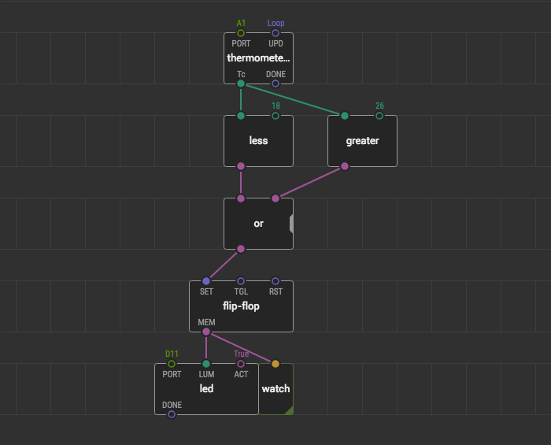

<!--
This file is auto-generated from the 'welcome-to-xod' project.
Do not change this file manually because your changes may be lost after
the tutorial update.

To make changes, change the 'welcome-to-xod' contents or 'before-1st-h2.md'.

If you want to change a Fritzing scheme or comments for it, change the
'before-1st-h2.md' in the documentation directory for the patch.

Then run auto-generator tool (xod/tools/generate-tutorial-docs.js).
-->

Note
This is a web-version of a tutorial chapter embedded right into the XOD IDE.
To get a better learning experience we recommend to install the
<a href="/downloads/">desktop IDE</a> or start the
<a href="/ide/">browser-based IDE</a>, and you’ll see the same tutorial there.

# Permanent Alarm

Let's extend the alarm device and make the LED stay enabled after trigerring even after the condition is no longer met. This is useful to signalize that something gone wrong even if it was not observed immediatelly.

When the value gets out of the range, the `or` node sends a pulse to the `SET` pin of the `flip-flop` node. So `MEM` returns `True` until we reset it, toggle it, or reboot the board.

## Instructions

Let's make the alarm resettable.

1. Add a `button` node.
2. Set the corresponding `PORT`.
3. Link `PRS` with the `RST` pin.
4. Upload the program.

Heat or cool down the thermometer. Use the new button to turn the alarm off until the new trigger event is encountered.

  

    <a href="../202-alarm/">← Previous lesson</a>
  

  

    <a href="../">Index</a>
  

  

    <a href="../204-run-for-x-seconds/">Next lesson →</a>
  

