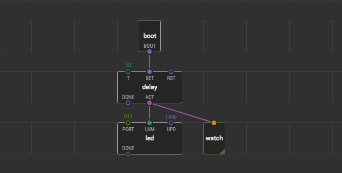

<!--
This file is auto-generated from the 'welcome-to-xod' project.
Do not change this file manually because your changes may be lost after
the tutorial update.

To make changes, change the 'welcome-to-xod' contents or 'before-1st-h2.md'.

If you want to change a Fritzing scheme or comments for it, change the
'before-1st-h2.md' in the documentation directory for the patch.

Then run auto-generator tool (xod/tools/generate-tutorial-docs.js).
-->

Note
This is a web-version of a tutorial chapter embedded right into the XOD IDE.
To get a better learning experience we recommend to install the
<a href="/downloads/">desktop IDE</a> or start the
<a href="/ide/">browser-based IDE</a>, and you’ll see the same tutorial there.

# Run for X Seconds

Here is a device that turns on the LED for ten seconds on boot.

The `delay` node helps us with this task. Generally, this node is used to postpone a pulse for some time, but when the `delay` node is activated it also outputs `True` value on the `ACT` pin. That's what we need.

## Exercise

Let’s modify the device so that the LED turns on for three seconds on a button press.

1. Replace `boot` with the a `button` node and bind the corresponding `PORT`.
2. Link it with the `SET` pin of the `delay` node.
3. Change the `T` value to 3.
4. Upload the program

Press the button and see how the LED behaves. Try to press the button many times while the LED glows and see how each press postpones the delay to be elapsed three seconds after the _last_ press.

## Additional excercise

Combine a few `delay` nodes by chaining `DONE` and `SET` pins to get a custom pattern of the blinking LED. Use the `or` node to combine `ACT` values as necessary.

  

    <a href="../203-permanent-alarm/">← Previous lesson</a>
  

  

    <a href="../">Index</a>
  

  

    <a href="../205-loops/">Next lesson →</a>
  

