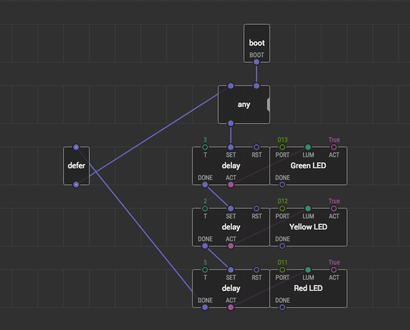

<!--
This file is auto-generated from the 'welcome-to-xod' project.
Do not change this file manually because your changes may be lost after
the tutorial update.

To make changes, change the 'welcome-to-xod' contents or 'before-1st-h2.md'.

If you want to change a Fritzing scheme or comments for it, change the
'before-1st-h2.md' in the documentation directory for the patch.

Then run auto-generator tool (xod/tools/generate-tutorial-docs.js).
-->

Note
This is a web-version of a tutorial chapter embedded right into the XOD IDE.
To get a better learning experience we recommend to install the
<a href="/downloads/">desktop IDE</a> or start the
<a href="/ide/">browser-based IDE</a>, and you’ll see the same tutorial there.

# Loops

Let's make a simple traffic light. Each light is activated by the `delay` node. When the latest one finishes it sends a pulse to the begining and our traffic light starts over.

To make the loop we need a special `defer` node. When `defer` node receives some value or pulse it postpones downstream nodes evaluation until the next transaction.

The `defer` node is always required when you make a loop to avoid deadlocks. For now, you can remember to place `defer` nodes right in the places where you want to complete a feedback loop. Read the guide to better understand the [execution model](https://xod.io/docs/guide/execution-model/#feedback-loops-handling?utm_source=ide&utm_medium=ide_comment&utm_campaign=tutorial).

Program begins with the initial `boot` pulse. Then each delay node triggers the next one. The latest one pulses back to the beginning, and it works continuously.

## Exercise

Let's bring the button back and make the device start with the button press.

1.  Assemble a circuit according to the [scheme](https://xod.io/docs/tutorial/205-loops/?utm_source=ide&utm_medium=ide_comment&utm_campaign=tutorial#circuit).
2.  Replace `boot` with the `button` node and bind the corresponding `PORT` value.
3.  Link with a free pin of the `any` node.
4.  Upload the program.

Press the button to run the chain.

  

    <a href="../204-run-for-x-seconds/">← Previous lesson</a>
  

  

    <a href="../">Index</a>
  

  

    <a href="../206-fade/">Next lesson →</a>
  

