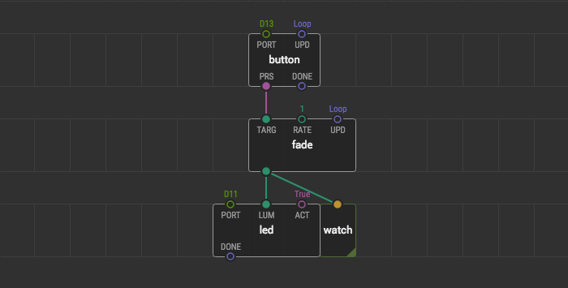

<!--
This file is auto-generated from the 'welcome-to-xod' project.
Do not change this file manually because your changes may be lost after
the tutorial update.

To make changes, change the 'welcome-to-xod' contents or 'before-1st-h2.md'.

If you want to change a Fritzing scheme or comments for it, change the
'before-1st-h2.md' in the documentation directory for the patch.

Then run auto-generator tool (xod/tools/generate-tutorial-docs.js).
-->

Note
This is a web-version of a tutorial chapter embedded right into the XOD IDE.
To get a better learning experience we recommend to install the
<a href="/downloads/">desktop IDE</a> or start the
<a href="/ide/">browser-based IDE</a>, and you’ll see the same tutorial there.

# Fade

Here is a program with the LED that turns on smoothly while the button is pressed.

To make a smooth transition from 0 to 1 and vice versa we use the `fade` node from the XOD standard library. It transforms its output value toward the target value with the rate specified.

In some cases this node helps to reduce bouncing or power bursts. For example, when you rotate a motor without smooth acceleration, it can cause a voltage drop and whole device reboot.

## Exercise

Test the `fade` node with `servo`.

1.  Add a `servo` next to `led` and link it with `fade` too.

2.  Bind 2.0 to the `RATE` pin to get a faster transition.

3.  Upload the program.

Press and hold the button a few times. Observe how `fade` smoothens the transition and changes the direction if the re-targeted in the middle of the process.

Remove the `fade` node, link to `button` directly, and take a look at the board. When the motor starts moving you can see board LEDs are dimming; the board even can reboot.

  

    <a href="../205-loops/">← Previous lesson</a>
  

  

    <a href="../">Index</a>
  

  

    <a href="../207-buses/">Next lesson →</a>
  

