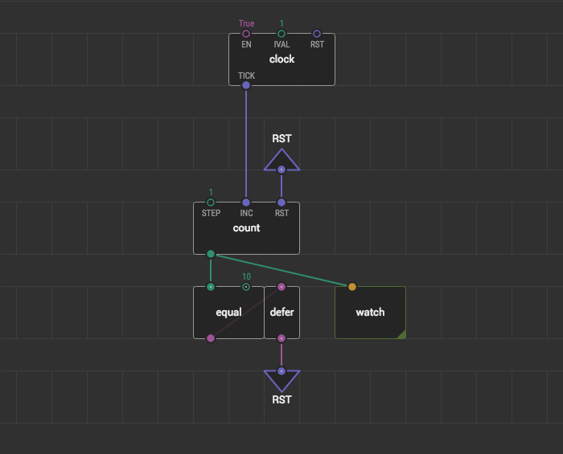

<!--
This file is auto-generated from the 'welcome-to-xod' project.
Do not change this file manually because your changes may be lost after
the tutorial update.

To make changes, change the 'welcome-to-xod' contents or 'before-1st-h2.md'.

If you want to change a Fritzing scheme or comments for it, change the
'before-1st-h2.md' in the documentation directory for the patch.

Then run auto-generator tool (xod/tools/generate-tutorial-docs.js).
-->

Note
This is a web-version of a tutorial chapter embedded right into the XOD IDE.
To get a better learning experience we recommend to install the
<a href="/downloads/">desktop IDE</a> or start the
<a href="/ide/">browser-based IDE</a>, and you’ll see the same tutorial there.

# Buses

It's time to learn how to keep the program clean and get rid of link intersections.

You can see triangle nodes on the patch. These nodes are called _buses_.

It's an alternative way to link nodes' pins. They create “invisible” links. There are two node types in `xod/patch-nodes` that work in tandem:

- `to-bus` — defines a new bus

- `from-bus` — sources data from an existing bus

Bus nodes with the same label are considered to be implicitly interconnected by XOD. You can make a few `from-bus` nodes with the same label.

## Exercise

Link the `IVAL` pin with the counter output using bus nodes.

1.  First of all, we'll make a loop. So place a `defer` node.
2.  Place `to-bus`.
3.  Label it "IVAL".
4.  Link these nodes.
5.  Click on the `IVAL` pin of the `clock` node and the press the "B" key on your keyboard. The label automatically sets from the linking pin label.
6.  Upload the program.

## 👆 Shortcut

Another fast way to create a bus is from an existing link. Select a link and press "B". XOD breaks the link and adds bus nodes instead.

  

    <a href="../206-fade/">← Previous lesson</a>
  

  

    <a href="../">Index</a>
  

  

    <a href="../208-accumulator/">Next lesson →</a>
  

