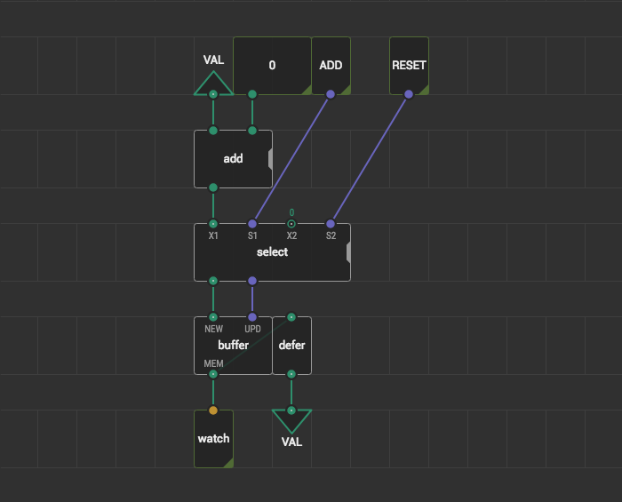

<!--
This file is auto-generated from the 'welcome-to-xod' project.
Do not change this file manually because your changes may be lost after
the tutorial update.

To make changes, change the 'welcome-to-xod' contents or 'before-1st-h2.md'.

If you want to change a Fritzing scheme or comments for it, change the
'before-1st-h2.md' in the documentation directory for the patch.

Then run auto-generator tool (xod/tools/generate-tutorial-docs.js).
-->

Note
This is a web-version of a tutorial chapter embedded right into the XOD IDE.
To get a better learning experience we recommend to install the
<a href="/downloads/">desktop IDE</a> or start the
<a href="/ide/">browser-based IDE</a>, and you’ll see the same tutorial there.

# Accumulator

Let's make a device which helps us in adding numbers. We will learn how to memorize values and update them.

The XOD standard library contains a `buffer` node which memorizes the input value when it receives a pulse.

To make some calculations and apply them to a stored value we should make a loop from the buffer output to the calculations and back to the buffer input.

To avoid limitless calculations and make it possible to reset the buffer we need a `select` node. It feeds the calculation result to the `buffer` node on a pulse.

In this example we're using the `add` node, but the calculation may be arbitrary complex.

## Exercise

Examine how the input value and pulses affect the stored result.

1.  Upload the program.
2.  Change the `tweak-number` value.
3.  Send pulse from the "ADD" node.
4.  Repeat the second and third steps a few times.
5.  Send pulse from "RESET".

Replace tweak nodes with a coin acceptor and button to make a ticket system or photo booth.

  

    <a href="../207-buses/">← Previous lesson</a>
  

  

    <a href="../">Index</a>
  

  

    <a href="../209-slow-down/">Next lesson →</a>
  

