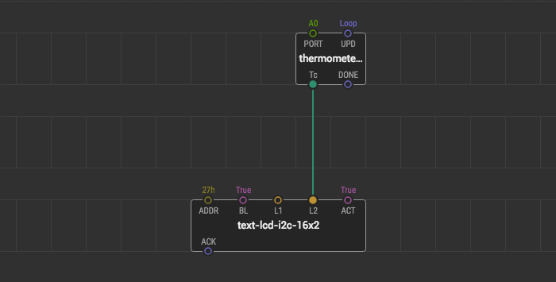

<!--
This file is auto-generated from the 'welcome-to-xod' project.
Do not change this file manually because your changes may be lost after
the tutorial update.

To make changes, change the 'welcome-to-xod' contents or 'before-1st-h2.md'.

If you want to change a Fritzing scheme or comments for it, change the
'before-1st-h2.md' in the documentation directory for the patch.

Then run auto-generator tool (xod/tools/generate-tutorial-docs.js).
-->

Note
This is a web-version of a tutorial chapter embedded right into the XOD IDE.
To get a better learning experience we recommend to install the
<a href="/downloads/">desktop IDE</a> or start the
<a href="/ide/">browser-based IDE</a>, and you’ll see the same tutorial there.

# Slow Down

You often see the "Loop" value bound to `UPD` pins.

"Loop" (also known as "Continuously") means that XOD tries to pulse these nodes as fast as it can. These nodes evaluate themselves on each transaction.

Sometimes it's excessive and may lead to slowing the program performance. Especially if you're working with sensors that depend on timing like an ultrasonic range meter.

To avoid this, you can replace the "Continuously" with another source that pulses with the desired interval or only when necessary. For example, a `clock` node.

## Exercise

Make the temperature display less sporadic.

1. Place a `clock` node.
2. Link it with the `UPD` pin of the `thermometer-tmp36` node.
3. Upload the program.

Heat and cool down the thermometer and observe the incremental changes of the data shown.

  

    <a href="../208-accumulator/">← Previous lesson</a>
  

  

    <a href="../">Index</a>
  

  

    <a href="../210-string-formatting/">Next lesson →</a>
  

