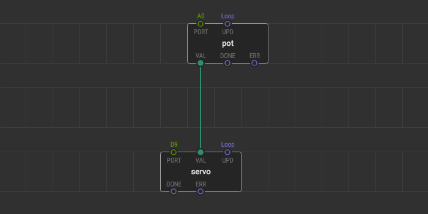

# #21. Импульс

Примечание
Это веб-версия обучения, встроенная прямо в XOD IDE.
Для удобства обучения, мы рекомендуем установить
<a href="/downloads/">desktop IDE</a> или открыть
<a href="/ide/">browser-based IDE</a>, и вы увидите тот же учебник.

В [десятой главе](../10-math/), мы кратко упомянули синий пин `UPD` 
и тип данных _pulse_.

Этот тип очень отличается от всех остальных. Все значения в XOD
передается по ссылкам непрерывно, даже если значения не изменились. 
Тип же данных импульса сильно отличается. Это что-то, вроде, некой вспышки. В основном это
сообщение, чтобы вызвать какое-либо другое действие. Сам по себе он не передает никаких данных. Тем не менее, это очень полезно, когда вам нужно сообщить, что произошло событие или дать старт другой команде.

Например, предположим, что нода `pot` должна получать информацию порта платы
только через определенные промежутки времени, а не все время. Эту частоту как раз и можно установить с помощью импульсов.

Каждый раз, когда импульс поступает на пин`UPD`, нода считывает значения аналогового порта и
выводит значение на пин `VAL`. Это значение будет храниться там до тех пор, пока
не будет изменено другим значением.

То же самое касается и `servo`. Он будет получать обновленное значение только когда получает импульс к `UPD`.

Поведение пина `UPD` можно настроить в Инспекторе. Для потенциометра возможен выбор:

- `Never`: никогда не производить импульсы. То есть, не принимать показания или делать обновления вообще.
- `On boot`: генерирует импульс один раз при запуске. Обновляет состояние ровно один раз.
- `Continuously`: постоянно генерировать импульсы, т.е. снимать показания или обновления с максимально возможной скоростью.

## Схема

[↓Скачать Fritzing проект](./circuit.fzz)

## Как использовать

1.  Откройте Инспектор для ноды `pot`.
2.  Измените значение`UPD` на `On boot`.
3.  Загрузите патч в Arduino.

Поверните ручку потенциометра и нажмите кнопку сброса на самой плате.
Обратите внимание, что потенциометр обновляется только один раз при включении Arduino.
