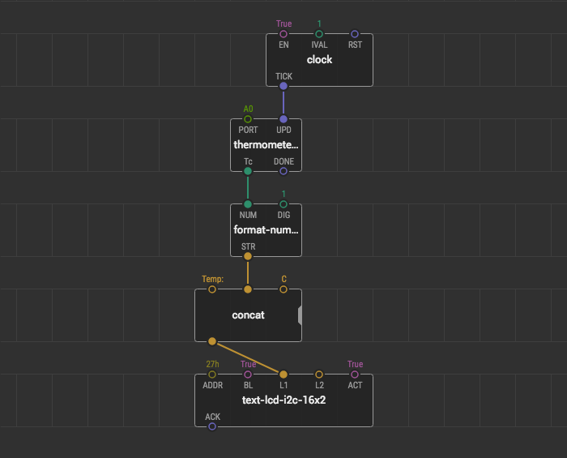

<!--
This file is auto-generated from the 'welcome-to-xod' project.
Do not change this file manually because your changes may be lost after
the tutorial update.

To make changes, change the 'welcome-to-xod' contents or 'before-1st-h2.md'.

If you want to change a Fritzing scheme or comments for it, change the
'before-1st-h2.md' in the documentation directory for the patch.

Then run auto-generator tool (xod/tools/generate-tutorial-docs.js).
-->

Note
This is a web-version of a tutorial chapter embedded right into the XOD IDE.
To get a better learning experience we recommend to install the
<a href="/downloads/">desktop IDE</a> or start the
<a href="/ide/">browser-based IDE</a>, and you’ll see the same tutorial there.

# String Formatting

Here is a program with a text LCD that shows the temperature. We already formatted the thermometers output to get a human readable string on the LCD like "Temp: 14.3C".

The `format-number` node transforms the number value to a string with a desired precision.

The `concat` node concatenates a three parts of the string that we want to see on the display.

To show non-ASCII characters you should specify its hexadecimal character code in the special "\x" notation. Codes differ on various LCD models. For example, if you have an MT-16S2H, the degree character is "\x99". Check out character tables for your model in its datasheet.

## Instructions

Let's improve the thermometer to show the degree character on the LCD.

1. Bind 2 to `DIG`.
2. Add one more input pin for the `concat` node by grabbing the handle.
3. Bind "\x99" instead of "C".
4. Bind "C" to the latest pin of `concat`.
5. Upload the program.

  

    <a href="../209-slow-down/">← Previous lesson</a>
  

  

    <a href="../">Index</a>
  

  

    <a href="../211-units-of-measure/">Next lesson →</a>
  

