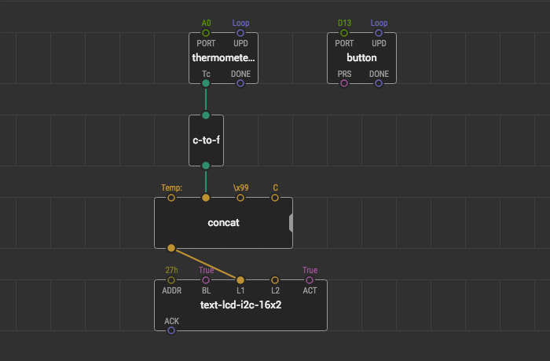

<!--
This file is auto-generated from the 'welcome-to-xod' project.
Do not change this file manually because your changes may be lost after
the tutorial update.

To make changes, change the 'welcome-to-xod' contents or 'before-1st-h2.md'.

If you want to change a Fritzing scheme or comments for it, change the
'before-1st-h2.md' in the documentation directory for the patch.

Then run auto-generator tool (xod/tools/generate-tutorial-docs.js).
-->

Note
This is a web-version of a tutorial chapter embedded right into the XOD IDE.
To get a better learning experience we recommend to install the
<a href="/downloads/">desktop IDE</a> or start the
<a href="/ide/">browser-based IDE</a>, and you’ll see the same tutorial there.

# Units of Measure

The standard `xod/units` library contains a few nodes for converting some popular units. For example, Celsius to Fahrenheit, degrees to radians and so on.

One of these nodes (`c-to-f`) is already on the patch and the program shows temperature in Fahrenheit.

## Exercise

Let's improve the program to see a temperature in Fahrenheit only when the button is pressed.

1. Add `if-else` below `button`.
2. Link `PRS` with `COND`.
3. Link `Tc` with `F`.
4. Link output from `c-to-f` with `T`.
5. Link `R` with the second pin of `concat`.
6. Upload the program.

Great! However, we still get a "C" on the LCD, even when the temperature converted to the Fahrenheit. Let's fix it.

1. Add one more `if-else`.
2. Link `PRS` to the new `COND` pin.
3. Bind `"F"` to the `T` pin, and `"C"` to the `F` pin.
4. Link `R` with the latest pin of the `concat` node.
5. Upload the program again.

## 👆 Remember the quotes

As was mentioned, the `if-else` node can work with numbers _and_ strings depending on the incoming value type. The `"F"` and `"C"` values you bind have to be put in quotes so that XOD knows what data type do you mean.

See the [generic nodes guide](https://xod.io/docs/guide/generics/?utm_source=ide&utm_medium=ide_comment&utm_campaign=tutorial) for better understanding.

  

    <a href="../210-string-formatting/">← Previous lesson</a>
  

  

    <a href="../">Index</a>
  

  

    <a href="../300-creating-nodes/">Next lesson →</a>
  

