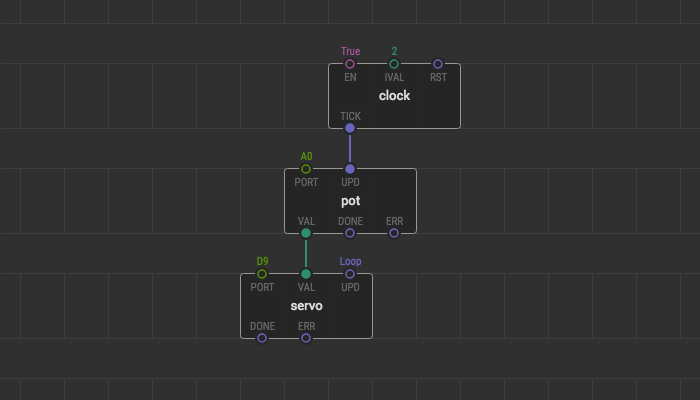

# #22. Нода времени

Примечание
Это веб-версия обучения, встроенная прямо в XOD IDE.
Для удобства обучения, мы рекомендуем установить
<a href="/downloads/">desktop IDE</a> или открыть
<a href="/ide/">browser-based IDE</a>, и вы увидите тот же учебник.

Во многих задачах требуется установить определенную частоту генерации импульсов.

Для этого нам нужна новая нода `clock`. Эта нода может производить сигналы импульса в соответствии с интервалами определенными в пине `IVAL`. Таким образом мы можем контролировать частоту сбора информации с наших датчиков.

Попробуйте установить пин`IVAL` в `clock` ноде на `2`. Это значит что она будет
посылать импульс каждые две секунды.

## Схема

Примечание
Схема, как в прошлом уроке.

[↓ Скачать проект Fritzing](./circuit.fzz)

Медленно поверните ручку потенциометра. Вы увидите, что показания
считываются и серво реагирует на них каждые две секунды.
