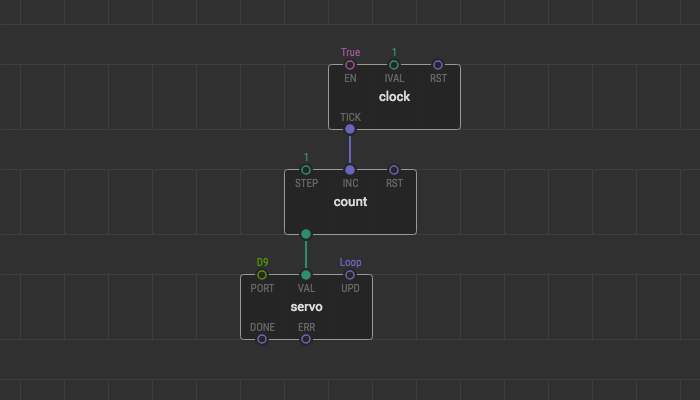

# #23. Счетчик импульсов

Примечание
Это веб-версия обучения, встроенная прямо в XOD IDE.
Для удобства обучения, мы рекомендуем установить
<a href="/downloads/">desktop IDE</a> или открыть
<a href="/ide/">browser-based IDE</a>, и вы увидите тот же учебник.

Давайте сделаем  что-то напоминающее часы. Теперь у нас есть все для этого.

Самим механизмом часов будет сервомотор. Используя ноду `count`, мы зададим его вращение от 0° к 180° за одну минуту.

Нода `count` работает как простой счетчик. Каждый раз, когда она получает импульс, она
увеличивает выходное число, с шагом пина `STEP`.

## Схема

[↓Скачать проект Fritzing](./circuit.fzz)

## Как использовать

1.  В ноде `clock` установите значение `IVAL` на `1` секунду.
2.  В ноде `count` установите значение `STEP` на `0.017`. Это значит, что каждый раз, когда
    импульс подается на пин `INC` (в нашем случае, раз в секунду), нода будет
    увеличьте число на выходном пине на 0,017. Для ноды сервопривода, это примерно 3°.
3.  Загрузите патч в Arduino.

Вы увидите, что сервопривод "тикает" каждую секунду. За одну минуту, сервопривод будет
достигать 180°. Нода `count` работает как простой счетчик. Каждый раз, когда она получает
импульс, она увеличивает число, которое она выдает, на шаг пина `STEP`.
