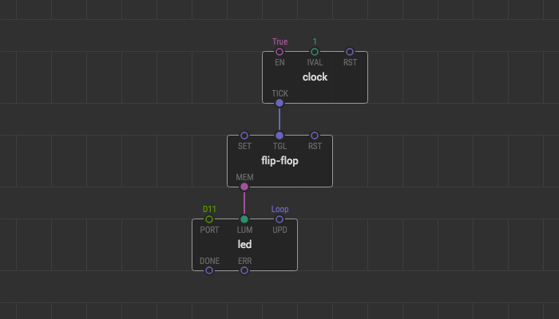

# #24. функция Flip-flop 

Примечание
Это веб-версия обучения, встроенная прямо в XOD IDE.
Для удобства обучения, мы рекомендуем установить
<a href="/downloads/">desktop IDE</a> или открыть
<a href="/ide/">browser-based IDE</a>, и вы увидите тот же учебник.

Вы можете управлять поведением многих нод с помощью импульсов. 
Очень полезной нодой является `flip-flop`. Онf действует как виртуальный коммутатор, состояние которого можно контролировать импульсами.

Давайте проведем классический эксперимент:  мигание светодиодом.

Каждый раз, когда импульс поступает на пин `TGL`, нода переключает логическое значение
на пине `MEM` между `false` и `true`.

## Схема

[↓Скачать проект Fritzing](./circuit.fzz)

## Как использовать

1.  Соберите цепь со светодиодом. Не забудьте указать нужный порт в пине`PORT`.
2.  Установите частоту мигания в секундах с помощью `IVAL`.
3.  Загрузите патч в Arduino.

Светодиод будет включаться и выключаться на выбранной Вами частоте. Попробуйте контролировать скорость мигания светодиода с помощью потенциометра. Для этого подключите  пин `IVAL`. Каждый раз, когда импульс поступает на пин`TGL`, нода переключает логическое значение на пине `MEM` между `false` и `true`.
