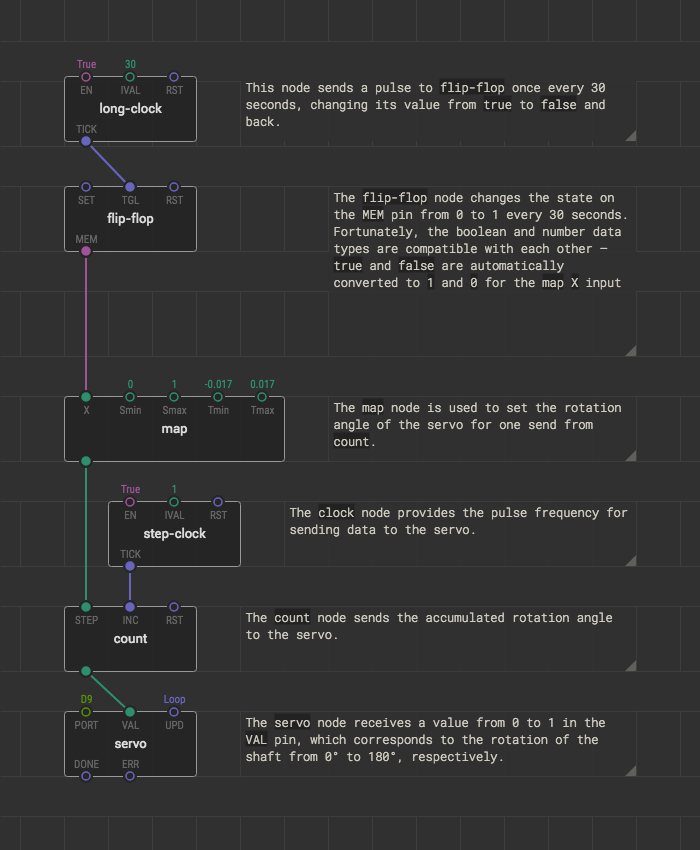

# #25. Использование нескольких временных счетчиков

Примечание
Это веб-версия обучения, встроенная прямо в XOD IDE.
Для удобства обучения, мы рекомендуем установить
<a href="/downloads/">desktop IDE</a> или открыть
<a href="/ide/">browser-based IDE</a>, и вы увидите тот же учебник.

Путем использование множества независимых счетчиков, мы можем создавать сложные программы и контролировать наши устройства. Здесь мы используем две ноды времени, для вращения сервопривода в одном направлении и затем в другом.

Патч для этой главы немного больше, чем то, что мы видели до сих пор. Хорошим тоном в XOD является создание патча так, чтобы он _читался снизу вверх_. Таким образом, вы можете
видеть причинно-следственную связь. Вы видите результат и то, что его вызвало!

Обратите особое внимание на ноду `map`. Вместо обычного способа её использования, мы протсо используем её, чтобы перевернуть знак выходного значения.

## Схема

[↓Скачать проект Fritzing](./circuit.fzz)

Сервопривод должен тикать в одном направлении в течение 30 секунд, а затем в другом
направление в течении 30 секунд.
