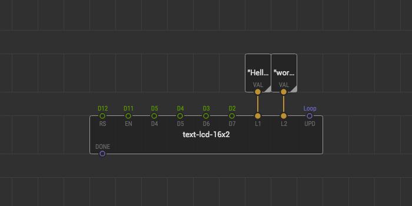

# #26. Отображение текста на ЖК-дисплее

Примечание
Это веб-версия обучения, встроенная прямо в XOD IDE.
Для удобства обучения, мы рекомендуем установить
<a href="/downloads/">desktop IDE</a> или открыть
<a href="/ide/">browser-based IDE</a>, и вы увидите тот же учебник.

Приготовьтесь, потому что мы собираемся узнать о ноде `text-lcd-16x2` ! 
Если вы еще не догадались, эта нода используется для управления 16х2 ЖК-дисплеями.

Теперь давайте сосредоточимся на двух нодах `constant-string`. Эти ноды содержат
и передают данные типа _string_. Желтый цвет используется для обозначения пинов и соединений с типом данных _string_ . string – это просто другое название для строки обычного текста. 

## Схема

Внимание
Будьте внимательны, когда в схеме много соединений, вероятность ошибиться возрастает.
Если текст отсутствует, дважды проверьте все соединения и поверните потенциометр
для настройки контрастности.

[↓Скачать Fritzing проект](./circuit.fzz)

## Как использовать

Теперь вы должны увидеть “Hello world“ на экране. Круто? 
Попробуйте отобразить любое ваше собственное сообщение на экране.
