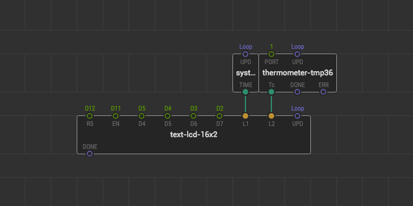

# #27 Отображение значений датчиков на ЖК-дисплее

Отображение статичных данных на дисплее – это очень скучно. 
У нас есть более интересные вещи, смотрите!

Давайте отобразим на дисплее что-нибудь полезное. Для этого примера, давайте отобразим на дисплее время с момента старта Arduino в секундах и данные, получаемые от термометра.

Тип данных number совместим с типом данных string. Значения датчика могут
передаваться без дополнительных преобразований. Они будут переданы с
точность двух знаков после запятой.

## Схема

[↓Скачать Fritzing проект](./circuit.fzz)

Теперь у вас есть портативный термометр. Попробуйте подключить другие датчики для того чтобы закрепить свои знания.

