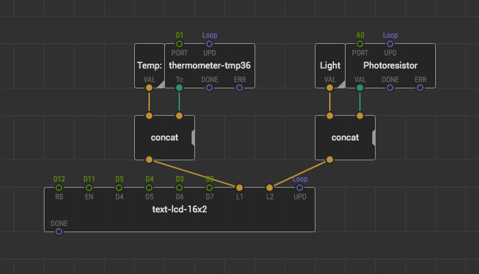

# #28. Работа со строками

Мы уже научились отображать показания наших сенсоров. 
Но если мы имеем более одного датчика, нам нужен способ различать показания.

Нода `concat` поможет в решении этой проблемы.

Нода `concat` позволяет объединить два текста в одну строку. 
В пине слева размещаем текст/данные, которые будут указаны первыми, в пине справа текст/данные, которые будут указаны далее в этой строке.

## Схема

[↓Скачать Fritzing проект](./circuit.fzz)

## Как использовать

1.  Найдите ноду `constant-string` в библиотеке. Добавьте по одному неизменному тексту. Кроме того, можно связать нужное значение непосредственно 
с пином `concat` в Инспекторе.
2.  Присвойте string значения каждой ноде с помощью Инспектора. Попробуйте что-то вроде
    “Temp: ” и “Light: ”, делайте эти надписи лаконичными. Поставлен пробел в конце, для того чтобы, когда мы объединим текст 
    с другим текстом, они не сливались.
3.  Соедините `VAL` пины `constant-string` нод с пинами слева у нод
    `concat`. `IN1` – это начало строки, это первая часть.
4.  Соедините выходные пины термометра и фоторезистора с правыми пинами нод `concat`.
 Они будут второй частью итоговых строк.
5.  Загрузите патч в Arduino.

Теперь показания датчиков отображаются на экране удобно и красиво!

## Попробуйте самостоятельно

Попробуйте добавить ещё отображение единиц измерения. 
Используйте для этого ещё пару нод `concat`. 
Но помните, что каждая строка дисплея ограничена 16 символами.

Попробуйте преобразовать градусы Цельсия в градусы Фаренгейта и обозначьте их соответствующим образом.
Ключ к решению этой задачи вы найдете в 14 уроке.
