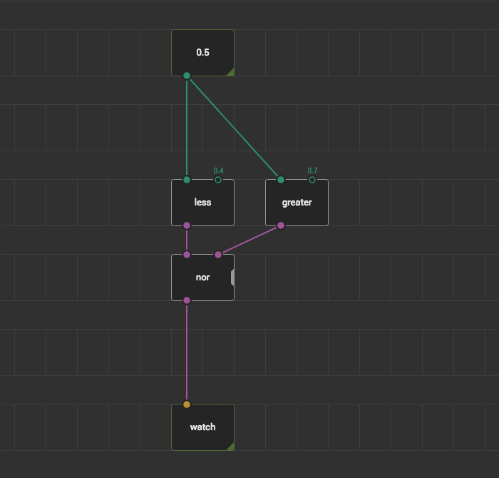

<!--
This file is auto-generated from the 'welcome-to-xod' project.
Do not change this file manually because your changes may be lost after
the tutorial update.

To make changes, change the 'welcome-to-xod' contents or 'before-1st-h2.md'.

If you want to change a Fritzing scheme or comments for it, change the
'before-1st-h2.md' in the documentation directory for the patch.

Then run auto-generator tool (xod/tools/generate-tutorial-docs.js).
-->

Note
This is a web-version of a tutorial chapter embedded right into the XOD IDE.
To get a better learning experience we recommend to install the
<a href="/downloads/">desktop IDE</a> or start the
<a href="/ide/">browser-based IDE</a>, and you’ll see the same tutorial there.

# Creating a New Patch

Here is a patch that checks if a number is between `0.4` and `0.7`. Let's make it reusable by converting into a node that takes three numbers and outputs a boolean. The first number is the one we want to check and the other two are boundaries instead of the hard-coded `0.4` and `0.7`.

⚠️ Before you proceed, remember the location of this chapter in the Project Browser to come back after you complete the instructions. Keeping the track might be easier if you open [this part of the tutorial in a web-browser](https://xod.io/docs/tutorial/301-create-new-patch/?utm_source=ide&utm_medium=ide_comment&utm_campaign=tutorial).

## Instructions

1.  Select `less`, `greater`, and `nor` nodes and copy them to the clipboard.
2.  Select File -> New Patch... from the main menu.
3.  Choose a name (`between` is a nice one).
4.  Your new patch will open in a new tab. Paste the nodes that you copied earlier there.

For the rest of this part of the tutorial we’ll evolve the node chapter after the chapter and effectively create many versions of it with incremental improvements. We recommend to mirror the improvements to the sole patch you created just now.

  

    <a href="../300-creating-nodes/">← Previous lesson</a>
  

  

    <a href="../">Index</a>
  

  

    <a href="../302-check-your-new-patch/">Next lesson →</a>
  

