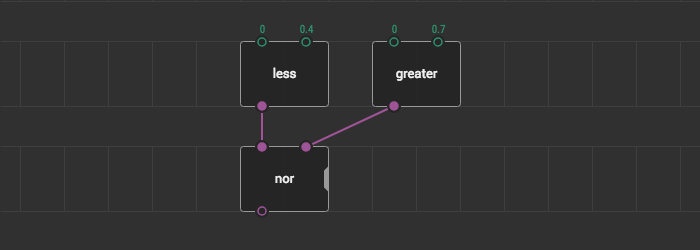

<!--
This file is auto-generated from the 'welcome-to-xod' project.
Do not change this file manually because your changes may be lost after
the tutorial update.

To make changes, change the 'welcome-to-xod' contents or 'before-1st-h2.md'.

If you want to change a Fritzing scheme or comments for it, change the
'before-1st-h2.md' in the documentation directory for the patch.

Then run auto-generator tool (xod/tools/generate-tutorial-docs.js).
-->

Note
This is a web-version of a tutorial chapter embedded right into the XOD IDE.
To get a better learning experience we recommend to install the
<a href="/downloads/">desktop IDE</a> or start the
<a href="/ide/">browser-based IDE</a>, and you’ll see the same tutorial there.

# Check Your New Patch

If the `between` patch you’ve created looks like this one, you did everything right!

Continue to the next chapter.

  

    <a href="../301-create-new-patch/">← Previous lesson</a>
  

  

    <a href="../">Index</a>
  

  

    <a href="../303-add-terminals/">Next lesson →</a>
  

