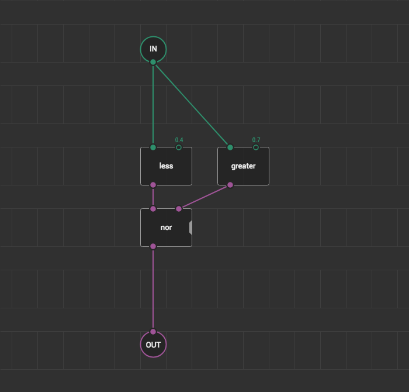

<!--
This file is auto-generated from the 'welcome-to-xod' project.
Do not change this file manually because your changes may be lost after
the tutorial update.

To make changes, change the 'welcome-to-xod' contents or 'before-1st-h2.md'.

If you want to change a Fritzing scheme or comments for it, change the
'before-1st-h2.md' in the documentation directory for the patch.

Then run auto-generator tool (xod/tools/generate-tutorial-docs.js).
-->

Note
This is a web-version of a tutorial chapter embedded right into the XOD IDE.
To get a better learning experience we recommend to install the
<a href="/downloads/">desktop IDE</a> or start the
<a href="/ide/">browser-based IDE</a>, and you’ll see the same tutorial there.

# Terminals

We need a way for the `between` node to get values in and put values out. In XOD patch nodes interact with the outside world using terminal nodes. You can find the terminal nodes in `xod/patch-nodes` library, they are called `input-number`, `input-pulse`, `output-boolean`, etc.

On this patch, we already placed an `input-number` and `output-boolean` instead of `tweak-number` and `watch`. The terminals give our node one number input pin and one boolean output. You can check it out by invoking the help box for the node in Project Browser.

## Instructions

1.  Reflect the changes to your `between` patch: copy/paste the `IN` and `OUT` terminals there and link them accordingly.
1.  Add two more `input-number`s.
1.  Connect them to `less` and `greater`'s pins instead of hardcoded `0.4` and `0.7` values.
1.  Label the new terminals as `MIN` and `MAX` using Inspector.
1.  Check how the node looks now in the help panel.

Note that node's pin order is determined by the order of respective terminals. Try to reorder the input terminals and look how it affects the preview in the help panel.

## Pin naming convention

Conventionally XOD uses pin labels that are similar to IC leg labels. The labels contain at most four characters, and usually, they are mnemonics or abbreviations. The restriction allows rendering patches quite densely.

  

    <a href="../302-check-your-new-patch/">← Previous lesson</a>
  

  

    <a href="../">Index</a>
  

  

    <a href="../304-use-new-node/">Next lesson →</a>
  

